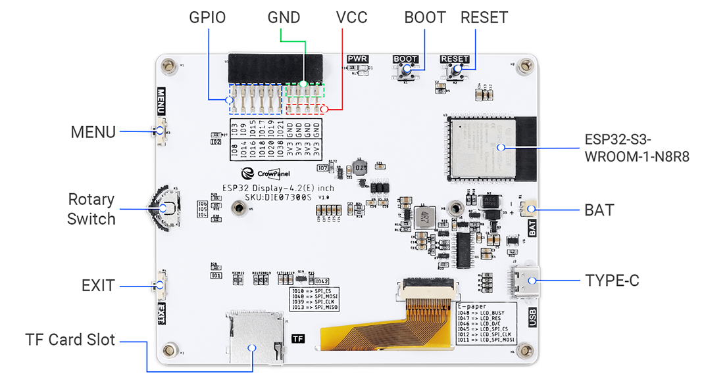

Geräteaufbau
============

Mechanischer Aufbau
-------------------

.. image:: ../pics/OBP40_Explode_View_Main_Unit_2.png
	:scale: 45%
Abb.: Explosionsansicht OBP40 Main Unit

In der oberen Abbildung ist der Aufbau des OBP40 zu sehen. Das Gerät besteht aus einzelnen Komponenten, die im folgenden beschrieben werden.

	* **Front Case**
		Die Frontschale des Gehäuses bildet den Abschluss des Gehäuses. Es ist als Kastenkonstruktion ausgeführt und dadurch verwindungssteif. Im Frontbereich sind schwarze Flächen eingelassen. Das Gehäuse wird als zweifarbiges Teil 3D gedruckt.
	* **Crow Panel 4.2**
		Die Elektronikeinheit **Crow Panel 4.2** mit Display ist eine käufliche Einheit der Firma **Elecrow**. Das Crow Panel 4.2 kann direkt über Elecrow oder über einige Elektronik-Versandfirmen bezogen werden. Es wird mit einer Testfirmware ausgeliefert, die den Funktionsumfang zeigt. Um das Crow Panel 4.2 als OBP40 nutzen zu können, muss eine neue Firmware aufgespielt werden.	
	* **LiPo Accu**
		Das OBP40 kann optional mit einem LiPo-Akku betrieben werden. Damit lässt sich das OBP40 autark mehr als 8 Stunden betreiben. Der LiPo-Akku wird fest mit der Platine an definierten Punkten mit der Hauptplatine verlötet. Das OBP40 wird dann dauerhaft mit Strom versorgt und kann bei Nichtbenutzung in einen stromsparenden Tiefschlaf versetzt werden.
	* **Backside Case**
		Die Gehäuserückseite schließt die Rückseite des Gehäuses ab. Sie enthält zusätzlich eine Aufnahme für den Magnet Dock, das Klettband und 4 Neodym-Haltemagnete. Das Klettband und die Haltemagnete können nach Bedarf benutzt werden.
	* **Magnet Dock**
		Das Magnet Dock dient zur Stromversorgung und zur Datenübertragung. Die Schnittstelle ist als USB-Schnittstelle ausgelegt. Das Magnet Dock dient zum Aufladen des LiPo-Akkus in der Docking-Station und zur Datenübertragung mit anderen Geräten wie z.B. einem Marine Control Server.
	* **Magnets**
		Die Magnete können zum Befestigen des OBP40 in der Ladeschale oder an metallischen Flächen verwendet werden.
	* **Velcro**
		In der Gehäuserückseite kann optional Klettband verwendet werden. Damit hat man eine unabhängige Befestigungsmöglichkeit an beliebigen Flächen.
	* **Screws**
		Die 4 Gehäuseschrauben verbinden die Frontschale mit der Rückseite. Die Gehäuseschrauben sind Bestandteil des Crow Panel 4.2 und können beim OBP40 wiederverwendet werden.
		
.. image:: ../pics/Docking_Station_2.png
	:scale: 45%
Abb.: Explosionsansicht Docking-Station

Die Docking-Station dient zur Aufnahme des OBP40. In der Docking-Station kann der Akku des OBP40 geladen werden. Zusätzlich besteht die Möglichkeit der Datenübertragung über eine USB-Verbindung.

	* **Screws**
		Die 6 Schrauben verbinden die Adapterplatte mit der Rückseite und dem Standfuß.
	* **Velcro**
		Das Klettband ist das Gegenstück zum Klettband auf der Rückseite des OBP40.	
	* **Adapter Plate**
		Die Adapterplatte dient zur Aufnahme des OBP40. Das OBP40 haftet mit den Magneten an den inneren 4 Schrauben, die zur Befestigung der Rückseite dienen.
	* **Magnet Dock**
		Das Magnet Dock ist das Gegenstück zum Magnet Dock im OBP40. Die vergoldeten Kontaktstifte sind federnd gelagert und können Lagetoleranzen in gewissen Grenzen ausgleichen. Die Schnittstelle ist als USB-Schnittstelle ausgelegt. Das Magnet Dock dient zum Aufladen des LiPo-Akkus in der Docking-Station und zur Datenübertragung.
	* **Backside Case**
		Die Rückseite wird zur Aufnahme des Magnet Dock verwendet. Die Rückseite enthält genügend Platz für weitere kleine Elektronik-Module. Es gibt noch eine weitere größere Version der Rückseite, die mehr Platz für Erweiterungen zur Verfügung stellt.
	* **Stand**
		Der Standfuß ist mit der Adapterplatte über zwei Schrauben verbunden. Durch den Standfuß ist die Adapterplatte leicht geneigt, so dass das Display des OBP40 besser abgelesen werden kann.
	
		
Main Board
----------

Das Crow Panel 4.2 Mainboard enthält alle elektrischen und elektronischen Komponenten wie:

	* Dual Core CPU ESP32-S3
	* Stromversorgung
	* Display-Ansteuerung
	* e-Paper-Display
	* Tasten
	* GPIO-Erweiterungsport
	* LiPo-Ladeschaltung
	* SD-Card-Adapter
	* USB-C

Abb.: Crow Panel 4.2 Mainboard Oberseite (Elecrow)

Schaltplan und Fertigungsunterlagen
-----------------------------------

Nachfolgend sind die Unterlagen für einen Nachbau aufgeführt.

* `Schaltplan V1.0 [PDF] <../_static/CrowPanel_ESP32_Display-4.2(E)_Inch.pdf>`_
* `3D-Daten Crow Panel 4.2 [ZIP] <../_static/files/3D_File_CrowPanel_ESP32_4.2_E-paper_HMI_Display.zip>`_
* `WiKi zum Crow Panel 4.2 [HTML]`_
* `Github Repository zum Crow Panel 4.2 [HTML]`_
* `Github Repository zur OBP40-Firmware [HTML]`_
* `3D-Daten OBP40 und Docking Station [ZIP] <../_static/files/Cases_OBP40.zip>`_

.. _WiKi zum Crow Panel 4.2 [HTML]: https://www.elecrow.com/wiki/CrowPanel_ESP32_E-paper_4.2-inch_HMI_Display.html
.. _Github Repository zum Crow Panel 4.2 [HTML]: https://github.com/Elecrow-RD/CrowPanel-ESP32-4.2-E-paper-HMI-Display-with-400-300
.. _Github Repository zur OBP40-Firmware [HTML]: https://github.com/norbert-walter/esp32-nmea2000-obp60

Die Fertigungsdaten zum Schaltplan und den 3D-Daten für das Crow Panel 4.2 unterliegen dem Urheberrecht der Firma Elecrow. Welche Art des Urheberrechtes zu Grunde liegt ist nicht bekannt. Die Unterlagen sind öffentlich über das Wiki und Github einsehbar und haben Public-Charakter.

.. image:: ../pics/Lizenz_by-nc-sa_eu.png
   :scale: 45%

Die 3D-Konstruktionsunterlagen der Mechanikteile zum OBP40 und zur Docking-Station unterliegen der `Common Creative Lizenz (CC) BY BC SA 4.0`_. Das OBP40 darf unter Nennung der Urheber nachgebaut oder modifiziert werden. Es entstehen keinerlei Kosten für eine private Nutzung ohne kommerzielle Absichten. Eine kommerzielle Verwertung wird durch die Lizenz ausgeschlossen. Abgeleitete Werke unterliegen der selben Lizenz. Wenn Sie eine kommerzielle Nutzung des OBP40 beabsichtigen, kontaktieren Sie uns über das `Kontaktformular`_. Es besteht die Möglichkeit, ein nicht exklusives Nutzungsrecht über eine kommerzielle Lizenz zu erwerben. Die Firmware des OBP40 steht unter der Apache 2.0 Lizenz.

.. _Common Creative Lizenz (CC) BY BC SA 4.0: https://creativecommons.org/licenses/by-nc-sa/4.0/legalcode.de
.. _Kontaktformular: https://open-boat-projects.org/de/kontakt
.. _Apache 2.0 Lizenz: https://www.apache.org/licenses/LICENSE-2.0
