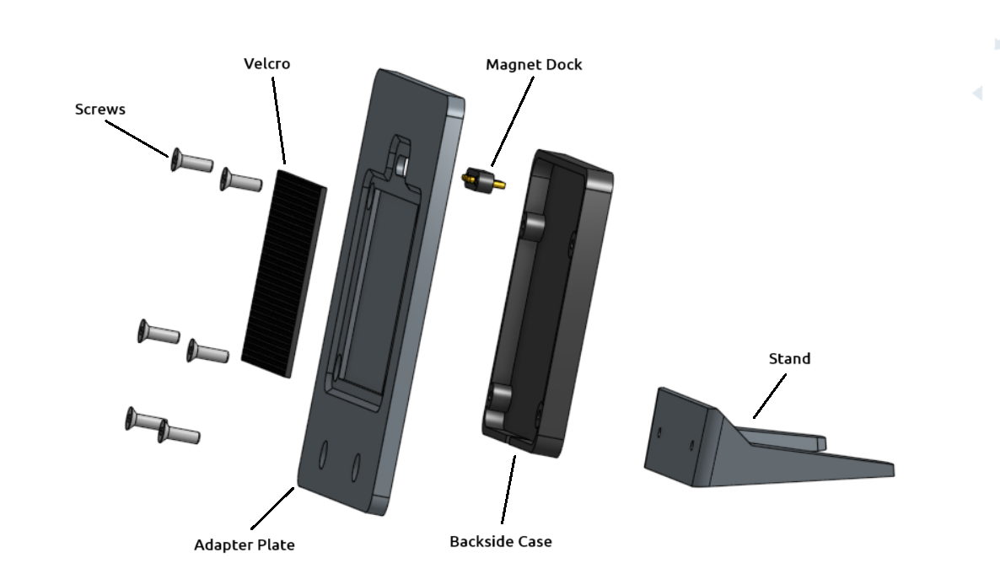

Montage Docking Station
=======================

Zusammenbauzeichnung
--------------------

	
Abb.: Montage Docking Station

Stückliste
----------

+------+--------+-----------------+--------------+----------------+
| Pos. | Anzahl | Bezeichnung     | Material     | Bezugsquelle   |
+======+========+=================+==============+================+
|  1   |   1    | Adapter Palte   | ABS / ASA    |`Filamentworld`_| 
+------+--------+-----------------+--------------+----------------+
|  2   |   1    | Backside Case   | ABS / ASA    |`Filamentworld`_| 
+------+--------+-----------------+--------------+----------------+
|  3   |   1    | Stand           | ABS / ASA    |`Filamentworld`_| 
+------+--------+-----------------+--------------+----------------+
|  5   |   1    | Magnet Dock     | 4 pol.       |`Aliexpress`_   | 
+------+--------+-----------------+--------------+----------------+
|  7   |   1    | Velcro D 3 mm   | 50 x 40 mm   |`Ebay`_         | 
+------+--------+-----------------+--------------+----------------+
|  8   |   6    | M3x6            | Stahl/Nickel |                | 
+------+--------+-----------------+--------------+----------------+

.. _Filamentworld: https://filamentworld.de/
.. _Ebay: https://www.ebay.de/itm/267017971020
.. _Aliexpress: https://de.aliexpress.com/item/1005007348770116.html?spm=a2g0o.order_list.order_list_main.5.54d95c5ftn0cyU&gatewayAdapt=glo2deu

Montageanleitung
----------------

Die Montage der Docking Station erfolgt nach der Montageanleitung in folgender Reihenfolge:

1. Gehäuseteile drucken
	Die Gehäuseteile lassen sich mit einem gewöhnlichen 3D-Drucker drucken. Verwenden Sie folgende Einstellungen:
	
	* 0.4 mm Düse
	* Wanddicke 1 mm
	* Wanddicke der Ober- und Unterseite 1 mm
	* Füllgrad 30 %
	* Support eingeschaltet

2. Magnet Dock mit Heißkleber in Rückwand einkleben
	Darauf achten, dass der Magnet Dock mittig sitzt und mit reichlich Heißkleber umschlossen ist, Darauf achten, dass kein Heißkleber nach außen dringt. Gegebenenfalls überschüssigen Heißkleber entfernen.
	
	+------------+-----------+-------------+
	| Lötpunkt   | Aderfarbe | Bauteil     |
	+============+===========+=============+
	| Pin 1      | rot, 5 V  | Magnet Dock |
	+------------+-----------+-------------+
	| Pin 2      | weiß, D-  | Magnet Dock |
	+------------+-----------+-------------+
	| Pin 3      | gelb, D+  | Magnet Dock |
	+------------+-----------+-------------+
	| Pin 4      | schwarz   | Magnet Dock |
	+------------+-----------+-------------+
	
	.. warning::
		Achten Sie beim Einkleben des Magnet Docks auf die richtige Orientierung. Sie muss passig zum Gegenstück im OBP40 sein. Wenn Sie mehrere OBP40 mit Docking-Station nutzen möchten, müssen alle Kontakte in der selben Orientierung eingebaut sein, damit die unterschiedlichen Geräte alle in der Docking-Station geladen werden können.
	
	.. image:: ../pics/Magnet_Dock_Orientation.png
		:scale: 100%
		
	Abb.: Ausrichtung der beiden Magnet-Dock-Teile
		
	.. image:: ../pics/OBP40_Docking_Station_2.png
		:scale: 45%	
		
	Abb.: Magnet-Dock in Halteplatte 

3. Klettband auf 50 x 40 mm zuschneiden und in Vertiefung der Rückwand einkleben
	Das Klettband so einkleben, dass es nicht an den Kanten übersteht und vollständig in der Vertiefung ist.	

4. Kunststoffteile mit Schrauben M3 verbinden
	.. hint::
		Wenn Sie die Schrauben erneut hereinschrauben wollen, drehen sie die Schrauben zuerst nach links bis das Gewinde spürbar einrastet und ziehen erst danach die Schraube rechts herum an. So vermeiden Sie eine Beschädigung des Gewindes.
