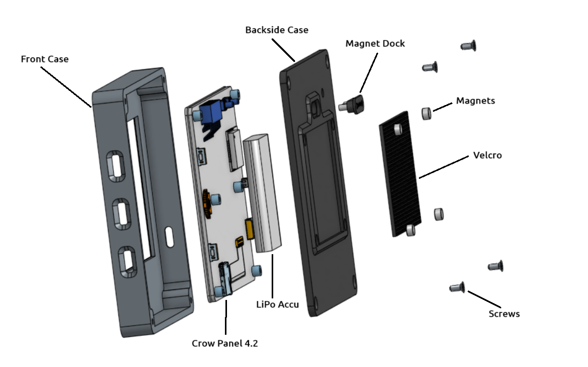

Montage OBP40
=============

Zusammenbauzeichnung
--------------------

Abb.: Montage OBP40 Main Unit

Stückliste
----------

+------+--------+----------------+--------------+
| Pos. | Anzahl | Bezeichnung    | Material     |
+======+========+================+==============+
|  1   |   1    | Front Case     | ABS / ASA    |
+------+--------+----------------+--------------+
|  2   |   1    | Backside Case  | ABS / ASA    |
+------+--------+----------------+--------------+
|  3   |   1    | Crow Panel 4.2 | FR4          |
+------+--------+----------------+--------------+
|  4   |   1    | LiPo-Akku      | 3.7V, 1200mA |
+------+--------+----------------+--------------+
|  5   |   1    | Magnet Dock    | 4 pol.       |
+------+--------+----------------+--------------+
|  6   |   4    | Magnete D5x3   | Neodym       |
+------+--------+----------------+--------------+
|  7   |   1    | Velcro D 3 mm  | 50 x 40 mm   |
+------+--------+----------------+--------------+
|  8   |   4    | M2.5x4         | Stahl/Nickel |
+------+--------+----------------+--------------+

Montageanleitung
----------------

Die Gehäusemontage erfolgt nach der Montageanleitung in folgeder Reihenfolge:

1. Gehäuseteile drucken
	Die Gehäuseteile lassen sich mit einem gewöhnlichen 3D-Drucker drucken. Verwenden Sie folgende Einstelleungen:
	
	* 0.4 mm Düse
	* Wanddicke 1 mm
	* Wanddicke der Ober- und Unterseite 1 mm
	* Füllgrad 30 %
	
2. Rückseite und Spacer des Crow Panel 4.2 abschrauben
	.. image:: ../pics/CrowPanel_4.2_Top_Side.png
		:scale: 45%
	Abb.: Crow Panel 4.2 Mainboard Oberseite (Elecrow)
	
3. Crow Panle 4.2 Platine in Frontschale einlegen
	Platine seitlich beginnend mit den Tastern in die Frontschale einlegen.

4. Magnet Dock mit Heißkleber in Rückwand einkleben
	Darauf achten, dass der Magnet Dock mittig sitzt und mit reichlich Heißkleber umschlossen ist, Darauf achten, dass kein Heißkleber nach außen dringt. Gegebenenfalls überschüssigen Heißkleber entfernen.

5. Magnete mit Heißkleber in Rückwand einkleben
	Vor dem einlegen der Magnete einen Klecks Heißkleber in die Vertiefung geben und zügig den Magneten einlegen, damit der Kleber nicht frühzeitig erstarrt. Darauf achten, dass nicht zu viel Heißkleber in der Vertiefung verwendet wird.

6. Klettband auf 50 x 40 mm zuschneiden und in Vertiefung der Rückwand einkleben
	Das Klettband so einkleben, dass es nicht an den Kanten übersteht und vollständig in der Vertiefung ist.

7. LiPo-Akku und Magnet Dock einbauen und Kabel anlöten
	Löten Sie die Kabel entsprechend des Bildes an.
	
	.. image:: ../pics/Schematic_USB_LiPo.png
		:scale: 45%
	Abb.: Lötpunkte für Anschlusskabel
	
	.. hint::
		Das Anlöten der Kabel erfordert gute Lötkenntnisse und qualitativ hochwertiges Lötwerkzeug, da die Anschlüsse sehr klein sind. Verwenden Sie einen regelbaren Lötkolben mit einer feinen Spitze und Lötzinn mit 0.5 mm Durchmesser. Flussmittel und Kupferband zum Aufnehmen von überschüssigem Lötzinn vereinfachen die Arbeiten. Wenn Sie sich die Arbeiten nicht zutrauen, kontaktieren Sie eine Fachkraft die ihnen behilflich ist. 
	.. warning::	
		Achten Sie darauf, dass sie keine Kurzschlüsse auf der Platine mit anderen Bauelementen verursachen. Löten sie nicht zu lange an den betreffenden Stellen, da sie sonst u.U. Bauelemente entlöten oder Leiterbahnen beschädigen. Kontrollieren Sie alle Lötstellen bevor Sie die Platine wieder in Betrieb nehmen. Prüfen Sie mit einem Digitalvoltmeter auf Kurzschlüsse an den Lötungen. Bedenken sie, dass Sie durch die Lötarbeiten die Garantie des Herstellers verlieren.

8. Rückwand auf Frontschale auflegen und mit Schrauben M2.5 verbinden
	Verwenden Sie die Schrauben, die sie beim Crow panel 4.2 an der Rückseite abgeschraubt haben. Die Löcher im Kunststoff sind so dimensioniert, dass sie die Schrauben mit etwas Druck einschrauben können. Das Geinde schneidet sich dann selbständig in den Kunststoff.

	.. hint::
		Wenn Sie die Schrauben erneut hereinschrauben wollen, drehen sie die Schrauben zu erst nach links bis das Gewinde spürbar einrastet und ziehen erst danach die Schraube rechts herum an. So vermeiden Sie eine Beschädigung des Geindes.
