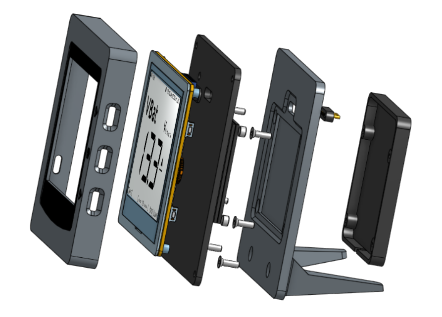

Technische Daten
================

Funktionen
----------

* Mobiles E-Paper Display (tageslichttauglich)
* Numerische Anzeigeseiten für 1, 2, 3 und 4 Werte (Werte frei wählbar)
* Grafische Anzeigeseiten (feste Werte)
* Trendanzeige für Werte
* 1 Auswahlrad mit Drucktaster und 2 Auswahltasten
* Magnet-Dock für Stromversorgung über Pogo-Pins
* Magnet- und Kletthalterung
* USB-Dockingstation zum Laden und zum Datenaustausch
* NMEA2000 (über Hardwareerweiterung)
* NMEA0183 (über WiFi oder über Hardwareerweiterung)
* NMEA2000/NMEA0183 Gateway (bidirektional)
* I2C (über Erweiterungsport)
* 1Wire (über Erweiterungsport)
* USB-C (OTG, Debug, NMEA0183)
* WiFi 2.4GHz (HTTP, TCP, UDP)
* Bluetooth (aktuell ungenutzt)
* LiPo-Akku-Tiefentladeschutz < 3,65V (erfordert LiPo-Akku)
* Low Power Modus (Deep Sleep)

Vergleich OBP40 / OBP60
-----------------------
+------------------------+--------+--------+
| Funktion               | OBP40  | OBP60  |
+========================+========+========+
| e-Paper-Display        | **X**  | **X**  |
+------------------------+--------+--------+
| Flash-Speicher         | **8MB**| **16** |
+------------------------+--------+--------+
| 12V-Stromversorgung    |        | **X**  |
+------------------------+--------+--------+
| LiPo-Akku              | **X**  |        |
+------------------------+--------+--------+
| Backup-Batterie        |        | **X**  |
+------------------------+--------+--------+
| USB-Stromversorgung    | **X**  | **X**  |
+------------------------+--------+--------+
| Wasserdichtes Gehäuse  |        | **X**  |
+------------------------+--------+--------+
| Außenanwendung möglich |        | **X**  |
+------------------------+--------+--------+
| Display-Schutzscheibe  |        | **X**  | 
+------------------------+--------+--------+       
| Display-Beleuchtung    |        | **X**  |
+------------------------+--------+--------+
| Display-Schutzfilter   |        | **X**  |
+------------------------+--------+--------+
| Flash-LED              |        | **X**  |
+------------------------+--------+--------+
| Buzzer                 |        | **X**  |
+------------------------+--------+--------+
| Echtzeituhr            |        | **X**  |
+------------------------+--------+--------+
| GPS-Empfänger          |        | **X**  |
+------------------------+--------+--------+
| Umweltsensor           |        | **X**  |
+------------------------+--------+--------+
| Tastenanzahl           | **3**  | **6**  |
+------------------------+--------+--------+
| Wischgesten            |        | **X**  |
+------------------------+--------+--------+
| Auswahlrad             | **X**  |        |
+------------------------+--------+--------+
| Reset-Taster           | **X**  | **X**  |
+------------------------+--------+--------+
| Flash-Taster           | **X**  |        |
+------------------------+--------+--------+
| WiFi 2.4 GHz           | **X**  | **X**  |
+------------------------+--------+--------+
| Bluetooth 4.0          | **X**  | **X**  |
+------------------------+--------+--------+
| NMEA0183 isoliert      |        | **X**  |
+------------------------+--------+--------+
| NMEA2000 isoliert      |        | **X**  |
+------------------------+--------+--------+
| I2C isoliert           | **O**  | **X**  |
+------------------------+--------+--------+
| 1Wire                  | **X**  | **X**  |
+------------------------+--------+--------+
| Schutzklasse           |**IP20**|**IP65**|
+------------------------+--------+--------+
| CE-Zertifizierung      |        | **X**  |
+------------------------+--------+--------+
**O**: nicht isoliert	

Aufbau
------

Spezifikation
-------------

+----------------------+-----------------------------+
| Versorgungsspannung  | 5 V, 1 A, USB-C, Magnet Dock|
+----------------------+-----------------------------+
| Stromverbrauch       | 0.5...3.5 W, typisch 0,5 W  |
+----------------------+-----------------------------+
| Prozessor            | ESP32-S3, Dual Core         |
+----------------------+-----------------------------+
| Clock Speed          | 80, 160, 240 MHz            |
+----------------------+-----------------------------+
| RAM                  | 512 kB                      |
+----------------------+-----------------------------+
| Flash                | 8 MB                        |
+----------------------+-----------------------------+
| PSRAM                | 8 MB                        |
+----------------------+-----------------------------+
| Displaygröße         | 400 x 300 pix, 120 dpi      |
+----------------------+-----------------------------+
| Refreshrate          | 1 Hz                        |
+----------------------+-----------------------------+
| Tasten               | mechan. Springfedertaster   |
+----------------------+-----------------------------+
| Akkutyp (optional)   | LiPo, 3,7V, 1200 mAh        |
+----------------------+-----------------------------+
| Ladezeit über USB    | ca. 2,5 h bei 600 mA        |
+----------------------+-----------------------------+
| Nutzungsdauer        | ca. 8,8 h bei Volllast      |
+----------------------+-----------------------------+
| Sleepdauer           | ca. 1,3 Jahre bei 1200 mAh  |
+----------------------+-----------------------------+
| Schutzgrad           | IP20                        |
+----------------------+-----------------------------+
| Abmessungen          | 110 x 112 x 22 mm           |
+----------------------+-----------------------------+
| Gewicht              | 110 g                       |
+----------------------+-----------------------------+

Anschlussbelegung
-----------------
.. image:: ../pics/OBP40_Side_View_2_t.png
   :scale: 50%
   

   
Abb.: USB-Port
   
.. image:: ../pics/CrowPanel_4.2_ESP32_HMI_E-paper_Display.png
   :scale: 50%
   
Abb.: Platinen-Anschlussbelegung

Erweiterungsport
----------------

+------------+----------+------------+----------+
| Oben       | Funktion | Unten      | Funktion |
+============+==========+============+==========+
| **GPOI8**  | 0183 Dir | **GPIO3**  | Analog In|
+------------+----------+------------+----------+
| **GPOI14** | 0183 RX  | **GPIO9**  | 0183 TX  |
+------------+----------+------------+----------+
| **GPOI16** | CAN RX   | **GPIO15** | CAN TX   |
+------------+----------+------------+----------+
| **GPOI18** | Buzzer   | **GPIO17** | 1Wire    |
+------------+----------+------------+----------+
| **GPOI20** | GPS TX   | **GPIO19** | GPS RX   |
+------------+----------+------------+----------+
| **GPOI38** | I2C SCL  | **GPIO21** | I2C SDA  |
+------------+----------+------------+----------+
| **3V3**    | 3.3V     | **GND**    | Masse    |
+------------+----------+------------+----------+
| **3V3**    | 3.3V     | **GND**    | Masse    |
+------------+----------+------------+----------+
| **3V3**    | 3.3V     | **GND**    | Masse    |
+------------+----------+------------+----------+
| **3V3**    | 3.3V     | **GND**    | Masse    |
+------------+----------+------------+----------+

   
Schaltplan
----------

* `Schaltplan V1.0 [PDF] <../_static/files/CrowPanel_ESP32_Display-4.2(E)_Inch.pdf>`_

Maßbilder
---------

* `Maßbild [PDF] <../_static/files/Drawing_OBP40_V2.pdf>`_

   
Nutzbare und konvertierbare Telegramme
--------------------------------------

**NMEA0183**
    * AIVDM, AIVDO, DBK, DBS, DBT, DPT, GGA, GLL, GSA, GSV, HDG, HDM, HDT, MTW, MWD, MWV, RMB, RMC, ROT, RSA, VHW, VTG, VWR, XDR, XTE, ZDA
    
**NMEA2000**
    * 126992, 127245, 127250, 127251, 127257, 127258, 127488, 127489, 127505, 127508, 128259, 128267, 128275, 129025, 129026, 129029, 129033, 129038, 129039, 129283, 129284, 129539, 129540, 129794, 129809, 129810, 130306, 130310, 130311, 130312, 130313, 130314, 130316
	
Nutzbare I2C-Sensorik
---------------------

**Umgebungssensoren**
	* BMP085, BMP180, BMP280, BME280, SHT20, HTU21
	
**Spannungs- und Stromsensoren**
	* INA226, INA219 (in Vorbereitung)
	
**Winkelsensoren**
	* AS5600, MT6701 (in Vorbereitung)
	
**Port-Erweiterungen**
	* PCF8574 (in Vorbereitung)
	
**Echtzeit-Uhren**
	* DS1388
	
Nutzbare 1Wire-Sensorik
-----------------------

**Temperatursensoren**
	* DS18B20
