.. _Bussysteme: 

Bussysteme
==========

.. image:: ../pics/NMEA_Bus.png
             :scale: 35%

Das OBP40 unterstützt mehrere Bussysteme über denn GPIO-Erweiterungsport. In diesem Kapitel geht es ausschließlich um die Vernetzung der Komponenten. Die dafür notwendige Software-Konfiguration finden Sie im darauf folgenden Kapitel :ref:`Datenaustausch`.

* **NMEA2000** über CAN-Bus (erfordert Leitungstreiber)
* **NMEA0183** über RS485/RS422-Bus (erfordert Leitungstreiber)
* **I2C-Bus**
* **1-Wire-Bus**
* **USB-C**

.. image:: ../pics/CrowPanel_4.2_ESP32_HMI_E-paper_Display.png
   :scale: 50%
Abb.: GPIO-Erweiterungsport

+------------+----------+------------+----------+
| Oben       | Funktion | Unten      | Funktion |
+============+==========+============+==========+
| **GPOI8**  | 0183 Dir | **GPIO3**  | Analog In|
+------------+----------+------------+----------+
| **GPOI14** | 0183 RX  | **GPIO9**  | 0183 TX  |
+------------+----------+------------+----------+
| **GPOI16** | CAN RX   | **GPIO15** | CAN TX   |
+------------+----------+------------+----------+
| **GPOI18** | Buzzer   | **GPIO17** | 1Wire    |
+------------+----------+------------+----------+
| **GPOI20** | GPS TX   | **GPIO19** | GPS RX   |
+------------+----------+------------+----------+
| **GPOI38** | I2C SCL  | **GPIO21** | I2C SDA  |
+------------+----------+------------+----------+
| **3V3**    | 3.3V     | **GND**    | Masse    |
+------------+----------+------------+----------+
| **3V3**    | 3.3V     | **GND**    | Masse    |
+------------+----------+------------+----------+
| **3V3**    | 3.3V     | **GND**    | Masse    |
+------------+----------+------------+----------+
| **3V3**    | 3.3V     | **GND**    | Masse    |
+------------+----------+------------+----------+
Tab.: Belegung Erweiterungsport

NMEA2000 und NMEA0183 sind Bussysteme, die im Marine-Bereich verwendet werden. Der I2C-Bus und der 1Wire-Bus kommen aus dem Elektronikbereich. Darüber lassen sich viele günstige Sensor-Module einbinden. Im Nachfolgenden werden die jeweiligen Bussysteme näher beschrieben.

NMEA2000
--------

NMEA2000 ist ein Bussystem und dient der Datenübertragung zwischen elektronischen Geräten in der Schifffahrt. NMEA2000 verwendet **CAN** zur Datenübertragung. Die Übertragung erfolgt über ein zentrales Kabel, an das alle Geräte parallel angeschlossen sind. Jedes Gerät im NMEA2000-Netzwerk hat eine eindeutige Geräte-ID, um Datenquellen und Datenanzeigegeräte zu identifizieren und zu adressieren. Daten werden in Parameter Group Numbers (**PGN**) organisiert. PGN sind eindeutige Daten-IDs, um bestimmte Typen von Daten zu beschreiben, wie beispielsweise Geschwindigkeit, Kurs, Temperatur usw. Alle Geräte können PGN empfangen und senden, auch kann festgelegt werden, welche PGN von einem bestimmten Gerät gesendet oder empfangen werden sollen.

**Spezifikation NMEA2000 im OBP40**

* Differenzielles, bidirektionales Datenprotokoll auf Binär-Basis
* Halb duplex mit Kollisionserkennung und Vermeidung
* Busstruktur (isoliert)
* Beidseitige Bus-Terminierung
* Unterstützte Protokolle
	* CAN (erfordert Leitungstreiber)
* Datenrate 250.000 Bit/s fix
* Buslänge bis zu 30 m (Stichleitungen <1.5 m)
	

**Differenzielle Datenübertragung**

Die Datenübertragung auf dem CAN-Bus erfolgt differenziell. Es werden jeweils zwei Signale mit entgegengesetzter Polarität vom Sender übertragen, die im Empfänger durch Subtraktion der beiden Signalen wieder zu einem Einzelsignal zusammen gefügt werden. Störungen, die sich in gleicher Weise auf beide Signalleitungen auswirken, werden durch die Subtraktion im Empfänger eliminiert. Dadurch wird eine robuste und störunanfällige Signalübertragung ermöglicht.

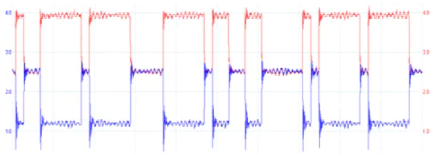

Abb.: Differenzielle Datenübertragung (rot CAN-H, blau CAN-L)

Die Datenrate von NMEA2000 beträgt **250 kbps**. Sie wurde gewählt, um eine ausreichend hohe Übertragungsgeschwindigkeit für eine Vielzahl von Anwendungen in Booten zu gewährleisten, während gleichzeitig eine möglichst effiziente Nutzung des Netzwerks sichergestellt wird. Mit einer Datenrate von 250 kbps können Sensordaten in Echtzeit übertragen werden, was für eine Vielzahl von Anwendungen wichtig ist, z.B. für die Überwachung der Schiffsposition, für Navigations- und Kommunikationsgeräte, Motorsysteme und weitere Systeme an Bord.

.. note::
	SeaTalk NG, SIMnet, Raynet, C-Net 2000 und CANet haben einige Ähnlichkeiten zu NMEA2000. Sie unterscheiden sich jedoch durch ihre spezifische Auslegung der Hardware und der Datentelegramme. SeaTalk NG und SIMnet sind teilweise kompatibel mit NMEA2000. Das bedeutet, dass einige Geräte, die für SeaTalk NG und SimNet entwickelt wurden, mit Abstrichen auch mit NMEA2000-Geräten kommunizieren können.
	
**Terminierung des Bussystems**
	
Ein CAN-Bus verwendet an den beiden Enden des Bussystems Abschluss-Widerstände von 120 Ohm zwischen den Leitungen CAN-H und CAN-L. Die beiden Abschluss-Widerstände entsprechen dem Leitungswiderstand von 120 Ohm und verhindern Signalreflexionen an den Leitungsenden bei hohen Datenübertragungsraten. Der CAN-Bus besteht aus einem langen Busstrang (Backbone) mit kurzen Stichleitungen kürzer als 1.5 m. Eine Sternstruktur des Bussystems ist nicht erlaubt. Die beiden Abschluss-Widerstände dürfen nur am Busende verbaut sein.

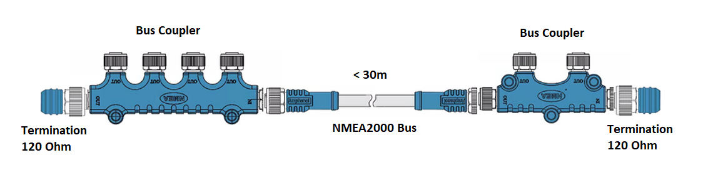
Abb.: CAN-Bus-Terminierung für NMEA2000 über ``T183``

.. warning::
	Einige Geräte besitzen eingebaute Abschluss-Widerstände, die durch entsprechende Schalter zu- oder abgeschaltet werden können. Vergewissern Sie sich vor dem Einfügen neuer Geräte in Ihr NMEA-2000-Netzwerk, ob integrierte Abschluss-Widerstände benutzt werden und wie sie konfiguriert sind. Falsch terminierte Busse können Übertragungsprobleme verursachen, die schwer zu finden sind.
	
.. tip::
	Um herauszufinden, ob nur zwei Widerstände im NMEA-Bus aktiv sind, können Sie ein Digitalvoltmeter benutzen. Wenn Sie eine Widerstandsmessung bei **spannungslosen NMEA-Bus** zwischen den Leitungen **CAN-High** und **CAN-Low** vornehmen, sollte ein Widerstand von ca. **60 Ohm** zu messen sein. Ist der Widerstand deutlich kleiner als 60 Ohm, sind weitere Geräte im Bussystem vorhanden, deren Abschlusswiderstände fälschlicherweise aktiv ist. Trennen Sie, während Sie laufend weiter den Widerstand messen, nacheinander ein Gerät nach dem anderen vom NMEA2000-Bus, bis sich der Widerstandswert deutlich erhöht. Beim zuletzt entnommenen Gerät sollte der Abschlusswiderstand deaktiviert werden. Ist der Widerstandswert danach noch immer nicht bei 60 Ohm, suchen Sie nach weiteren Geräten mit offensichtlich aktiviertem Abschlusswiderstand.  
	
**NMEA2000-Kabel**

.. image:: ../pics/NMEA_Bus.png
             :scale: 35%
	
Als Buskabel sollten nur hochwertige, wasserdichte und geschirmte Industrie-Kabel verwendet werden. Der Marine-Einzelhandel bietet dazu eine breite Auswahl an Produkten mit M12-Verbindungstechnik an, die sehr gut geeignet sind.

.. tip::
	Im Industriebereich findet man gleichwertige Kabel mit M12-Verbindungstechnik, die deutlich günstiger sind und ebenfalls verwendet werden können. Achten Sie dabei auf Steckverbinder mit **A-Kodierung**. Die Indexkerbe befindet sich zwischen Pin 1 und 2.

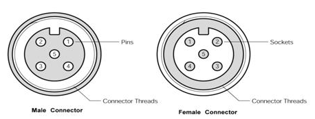
Abb.: Stecker und Buchse (Sicht auf Kontakte)

Die Belegung und Aderfarben sind in der nachfolgenden Tabelle zu sehen. Beachten Sie, dass die Farbbelegung bei Industriekabeln anders ausfallen kann. In dem Fall müssen Sie die Zuordnung der Aderfarben zu den Pins mit einem Ohmmeter ermitteln.

+----+-----------+--------+--------------------+
|Pin |Belegung   |Farbe   |Bedeutung           |
+====+===========+========+====================+
|1   |Schirmung  |ohne    |Schirmgeflecht      |
+----+-----------+--------+--------------------+
|2   |+12V       |rot     |Versorgungsspannung |
+----+-----------+--------+--------------------+
|3   |GND        |schwarz |Bord-Masse          |
+----+-----------+--------+--------------------+
|4   |CAN-H      |weiß    | CAN High-Signal    |
+----+-----------+--------+--------------------+
|5   |CAN-L      |blau    | CAN Low-Signal     |
+----+-----------+--------+--------------------+
Tab.: NMEA2000 Steckerbelegung

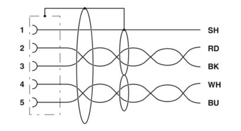
Abb. NMEA2000-Buskabel mit Schirmung

Wer eigene Buskabel herstellen möchte, sollte Kabel vergleichbar zum Typ "Lapp Busleitung UNITRONIC 2 x 2 x 0.34 mm²" verwenden.

.. image:: ../pics/CAN_Cable.png
             :scale: 60%			 
Abb. CAN-Buskabel

Dabei sind 2x zwei Einzeladern paarweise verdrillt und zusätzlich mit einem äußeren Schirmgeflecht umgeben. Ein verdrilltes Aderpaar wird für CAN-H und CAN-L verwendet und das andere Aderpaar für GND und 12V. Das Schirmgeflecht wird mit GND an nur einem Kabelende verbunden. Damit erzielt man die besten Ergebnisse und hat eine sichere und langlebige Installation. Dünnere Kabel als 0.34 mm² sollten nicht verwendet werden, wenn die Versorgung aus dem Bus erfolgen soll. Die Länge des Buskabels sollte in Summe 30 m nicht übersteigen.

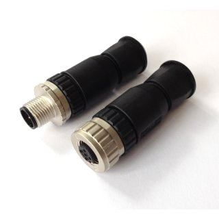
Abb.: NMEA2000 Stecker zur Selbstmontage

.. note::
	SeaTalk NG und Simnet benutzen eigene Steckverbinder, die untereinander nicht zu NMEA2000 kompatibel sind. Mit entsprechenden Konverter-Kabeln kann aber ein Datenaustausch zwischen diesen Netzen vorgenommen werden. Grundsätzlich sollte eine Mischung verschiedener Bustechnologien aber vermieden werden.

**Verkabelung für NMEA2000**

Für NMEA2000 wird eine Busstruktur verwendet. Im Hauptstrang sind eine oder mehrere Buskoppler-Einheiten enthalten, über die die jeweiligen Geräte eingebunden werden. Die Buslänge darf 30 m nicht übersteigen und die Stichleitungen zu den Geräten sollte nicht länger als 1.5 m sein. An den Enden des Hautstrangs befinden sich Abschlusswiderstände zur Bus-Terminierung. Die Einspeisung der Stromversorgung des NMEA2000-Busses erfolgt im unteren Bild über den Plotter.

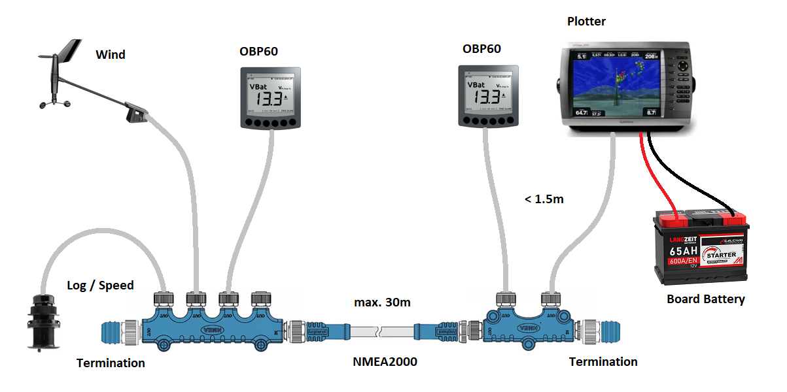
Abb.: NMEA2000-Bussystem mit Sensoren und Anzeigegeräten

Um das OBP40 an den NMEA2000-Bus anzuschließen, benötigt man eine CAN-Leitungstreiber. Die Anschlüsse CAN-H und CAN-L werden mit dem CAN-Bus verbunden. Die Masseleitung muss nicht aufgelegt werden.

.. image:: ../pics/OBP40_NMEA2000_Connection.png
             :scale: 60%	
Abb.: NMEA2000-Verbindung

**Kompatibilität zu Simnet und SeaTalk NG**

Simnet und SeaTalk GN besitzen eine eingeschränkte Kompatibitität zu NMEA2000. Beide Bussysteme setzen auf eigene Steckersysteme und verwenden teilweise propritäre NMEA2000-Telegramme. Die meisten gängigen NMEA2000-Bustelegramme werden von beiden Systemen unterstützt. Mit speziellen einfachen passiven Adapterkabeln können Simnet und SeaTalk GN Bussysteme mit einem NMEA2000 Bussystem verbunden werden. Das OBP40 kann dann Informationen aus Simnet oder SeaTalk NG über WiFi mit dem SeaSmart-Protokoll verarbeiten und auch Informationen in diese Bussysteme senden. Properitäre Telegramme werden nicht unterstützt, jedoch im Bussystem übertragen und weitergeleitet. 

NMEA0183
--------

NMEA0183 ist ein Standard für serielle Datenübertragung in der Schifffahrt. Es definiert ein Format für die Übertragung von Informationen zwischen Navigationsgeräten und anderen elektronischen Geräten auf Booten. NMEA0183 ist ein weit verbreiteter Standard, der vor allem von vielen älteren Geräten unterstützt wird.

**Spezifikation NMEA0183 im OBP40**

* Serielles, unidirektionales Datenprotokoll auf ASCII-Basis
* Punkt zu Punkt-Verbindung (isoliert)
* Simplex ohne Kollisionserkennung und Vermeidung
* Bus-Terminierung am Empfänger
* Unterstützte Protokolle
	* RS422 (Standard)
	* RS485
* Datenrate 1.200...460.800 Bd variabel
* Stromversorgung von Sensoren und Anzeigegeräten über 12V-Bordnetz
* Buslänge bis zu 1000 m (abhängig von Datenrate und Kabelart)
* Kabelart nicht spezifiziert
* Steckerart nicht spezifiziert	

**Datenübertragung**

Die Datenübertragung erfolgt im OBP40 halb duplex auf serielle Weise über zwei einfache Kabel. Das bedeutet, dass man etweder senden oder empfangen kann. Beides gleichzeitig ist nicht möglich. Die Standard-Datenrate liegt bei 4800 Bd, was für heutige Verhältnisse recht langsam ist, aber Buslängen von bis zu 1000 m zulässt. Als Datenübertragungsrate lassen sich folgende Einstellungen verwenden:

* 1.200 Bd
* 2.400 Bd
* 4.800 Bd
* 9.600 Bd
* 14.400 Bd
* 19.200 Bd
* 28.800 Bd
* 38.400 Bd
* 56.600 Bd
* 57.600 Bd
* 115.200 Bd
* 230.400 Bd
* 460.800 Bd

Je nach Datenrate und Protokoll können die zulässigen Kabellängen unterschiedlich lang ausfallen. Im realen Betrieb sollten diese Werte beachtet werden.

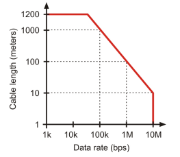
Abb.: Zulässige Kabellängen für RS422 und RS485

+-----------------+--------------------+
|Übertragungsrate | zul. Leitungslänge |
|[Bd]             | [m]                |
+=================+====================+
|4.800            | 300                |
+-----------------+--------------------+
|9.600            | 152                |
+-----------------+--------------------+
|19.200           | 15                 |
+-----------------+--------------------+
|57.600           | 5                  |
+-----------------+--------------------+
|115.200          | 2                  |
+-----------------+--------------------+
Tab.: Zulässige Leitungslängen für RS232

Die Datenübertragung erfolgt mit differenziellen Signalen ähnlich wie bei NMEA2000. Damit können Gleichtaktstörungen über lange Leitungslängen sicher unterdrückt werden.

Abb.: RS422-Übertragungsmodell Sender - Empfänger

**Multiplexer**

Insgesamt ist NMEA0183 ein nützlicher Standard für die Übertragung von Navigationsdaten auf Booten, aber er hat seine Beschränkungen und kann nicht in allen Einsatzfällen mit moderneren Technologien wie NMEA2000 mithalten. Um zum Beispiel Daten von mehreren Datenquellen wie z.B. Sensoren zu einem Datenstrom zusammenfassen zu können, sind in der NMEA0183-Welt Multiplexer notwendig.

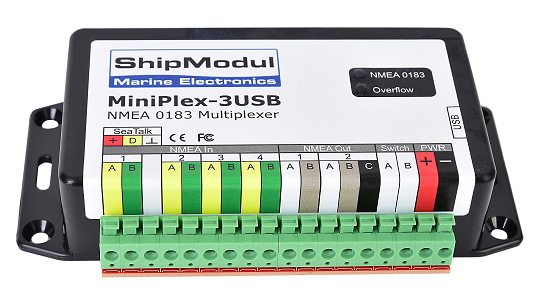
Abb.: NMEA0183 Multiplexer (Ship Modul)

Der Multiplexer empfängt verschiedene Datentelegramme an unterschiedlichen Ports und gibt den zusammengefassten Datenstrom mehrerer Sensoren an einem neuen Datenport aus. So lassen sich mehrere Sensorsignale über eine Leitung an ein Datenendgerät wie z.B. einen Plotter oder ein Multifunktionsdisplay übertragen. Viele Multiplexer bieten auch die Möglichkeit, bestimmte Datentelegramme im Datenstrom mit einer Filterfunktion zu unterdrücken. So können z.B. nur die wirklich notwendigen Daten an einen Autopiloten übertragen oder Mehrdeutigkeiten durch mehrere GPS-Empfänger vermieden werden.

**NMEA0183-Telegrammstruktur**

NMEA0183-Telegramme sind recht einfach aufgebaut und werden als ASCII-Datensätze übertragen. Ein NMEA0183-Telegramm besteht aus folgenden Informationen.

* Kennung
* Telegrammtyp
* Sensordaten
* Einheit
* Status
* CRC-Checksumme

Je nach Komplexität eines Telegramms können auch mehrere Sensordaten oder Statusinformationen in einem Telegramm übertragen werden. Nachfolgend ist beispielhaft das Telegramm eines Tiefenmessers dargestellt.

**DBT** - Depth below transducer

	$--DBT,a.a,b,c.c,d,e.e,f*hh<CR><LF>

	Feldnummer: 
		* a.a - Tiefe in Fuß
		* b - f = Fuß
		* c.c - Tiefe in Metern
		* d - M = Meter
		* e.e - Tiefe in Fathoms
		* f - F = Fathoms
		* hh - Checksumme
		
	Beispiel:	
	    * $IIDBT,12.8,f,39.0,M,21.3,F*20

Wer mehr Informationen zu NMEA0183-Telegrammen erfahren möchte, findet auf dieser `Webseite`_ ausführliche Informationen.

.. _Webseite: http://www.nmea.de/nmea0183datensaetze.html

**Verkabelung für NMEA0183**

Im nachfolgenden Bild ist eine Konfiguration zu sehen, in der ein NMEA0183-Windsensor mit dem OBP40 verbunden ist. Der Windsensor sendet die Daten zum OBP40, dieses ist als NMEA0183-Empfänger konfiguriert.

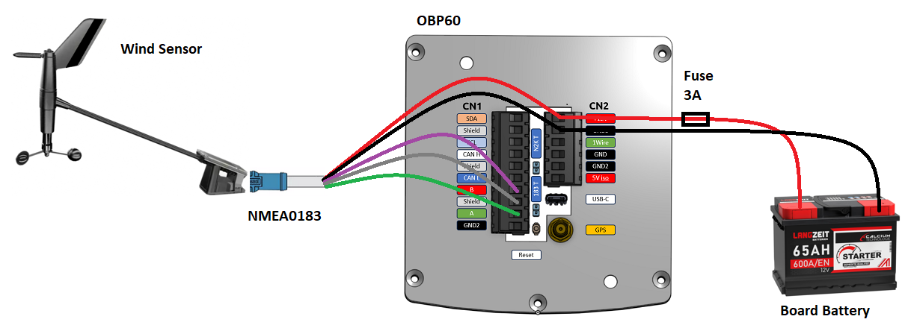
Abb.: NMEA0183-Minimalkonfiguration

.. hint::
    In ähnlicher Art und Weise können auch andere Sensoren an das OBP40 angebunden werden. Dabei ist aber zu berücksichtigen, dass immer nur ein Gerät oder Sensor mit dem OBP40 verbunden werden kann. Wenn mehere Geräte eingebunden werden sollen, dann benötigt man einen vorgeschalteten Multiplexer.
    
.. attention::
    Beachten Sie, dass bei NMEA0183-Datenübertragungen die selbe Übertragungsgeschwindigkeit für Sender und Empfänger und das selbe Übertragungsprotokoll verwendet werden muss. Anderenfalls kann keine Datenübertragung stattfinden. Die NMEA0183-Schnittstelle im OBP40 unterstützt das RS232-Protokoll nicht.

Die meisten Multiplexer haben mehrere NMEA0183-Eingänge und mindestens einen NMEA0183-Ausgang. Bei der Verwendung eines Multiplexers werden alle Sensoren an die NMEA0183-Eingänge des Multiplexers angeschlossen und der NMEA0183-Ausgang mit dem OBP40 verbunden. Der Multiplexer bündelt dann wie beschrieben die Datenströme aller Sensoren zu einem gemeinsamen Datenstrom am Ausgang. Über Filter am Datenausgang lässt sich die Datenmenge auf wichtige Daten eingrenzen. Das OBP40 ist in diesem Beispiel als Empfänger konfiguriert. Die Terminierung des Bussystems ist deaktiviert.

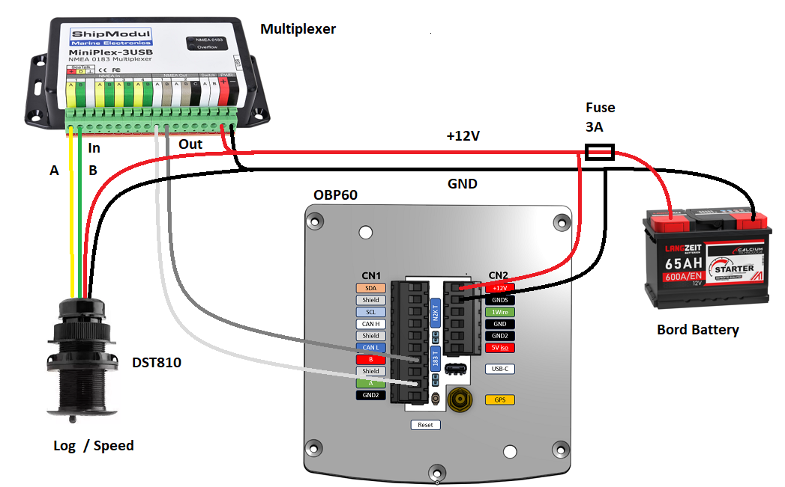
Abb.: NMEA0183-Verbindung zu einem Multiplexer

.. hint::
    Alle NMEA0183-Daten werden vom OBP40-Gateway automatisch nach NMEA2000 konvertiert. Die Konvertierung ist dabei unidirektional nur in Richtung NMEA2000. In umgekehrte Richtung nach NMEA0183 werden keine Daten konvertiert, da der NMEA0183-Port des OBP40 in der dargestellten Konfiguration im Empfangs-Modus arbeitet.
    
I2C
---

Der I2C-Bus dient zur Anbindung von elektronischen Komponenten. Er wird hauptsächlich im Elektronikbereich eingesetzt, um verschiedene Komponenten auf einer Platine miteinander kostengünstig zu verbinden. Die Verbindung erfolgt über eine Zweidrahtleitung und arbeitet mit Signalpegeln von 5.0V. Es gibt das Taktsignal **SCL** und das Datensignal **SDA**. Die Kommunikation läuft als Master- und Slave-System. Dabei steuert der Master die Slaves über eine eindeutige Adresse an und kann mit ihnen Daten austauschen.

**Spezifikation I2C im OBP40**

* Serielles, bidirektionales, synchrones Datenprotokoll auf Binär-Basis
* Busstruktur (isoliert)
* Halb duplex mit Kollisionserkennung und Vermeidung
* Bus-Terminierung intern über PullUp-Widerstände
* Unterstützte Protokolle
	* I2C, TTL 5.0V
* Datenrate 100.000 kBit/s variabel
* Stromversorgung von Sensoren und Anzeigegeräten über separate Leitungen
* Buslänge bis zu 1 m
* Kabelart nicht spezifiziert
* Steckerart nicht spezifiziert

Im OBP40 verwendet der I2C-Bus 3.3V TTL-Signalpegel. Die Anschlüsse kommen ungeschützt vom ESP32-S3. Bedenken Sie, dass die Leitungslänge des I2C-Buses nicht mehr als 1 m betragen sollte.

+--------+--------------------+
|Ausgang |Bedeutung           |
+========+====================+
|5Viso   |Versorgungsspannung |
+--------+--------------------+
|GND2    |Masse I2C           |
+--------+--------------------+
|Shield  |Schirmung I2C       |
+--------+--------------------+
|SCL     |Bus-Takt            |
+--------+--------------------+
|SDA     |Datenleitung        |
+--------+--------------------+

Im folgenden Bild ist ein I2C-Busaufbau mit 3 I2C-Sensoren zu sehen. Alle Sensoren sind mit geschirmten Kabeln mit dem I2C-Eingang am OBP40 verbunden.

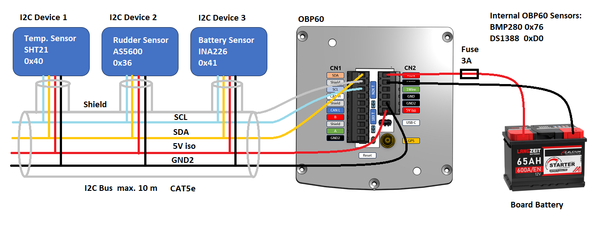
Abb.: I2C-Anbindung von externen Sensoren

.. note::
    Verwenden Sie für die Verkabelung externer Sensoren möglichst geschirmte Kabel und führen Sie den Schirm direkt bis zum Sensor. Verbinden Sie den Schirm des Sensorkabels direkt mit GND.
   
.. caution::
    Wenn Sie externe Sensoren oder Module am I2C-Bus verwenden wollen, dann prüfen Sie, ob es zu einem Adresskonflikt zwischen den verwendeten Sensoren oder Modulen kommen kann. Achten Sie darauf, dass I2C-Adressen nicht mehrfach vergeben sind. Es kommt dann zu Kommunikationsstörungen auf dem I2C-Bus. Insbesondere bei mehrfacher Verwendung gleicher Module müssen die I2C-Adressen verschieden eingestellt werden. Bei einigen I2C-Modulen ist das nicht möglich. In dem Fall können Sie nur ein I2C-Modul des jeweiligen Typs im Bus verwenden. Das OBP40 belegt selbst keine I2C Adressen.

.. caution::
    Nicht angeschlossene externe I2C-Sensoren, die jedoch in der Konfiguration aktiviert sind, führen dazu, dass die Reaktionsfähigkeit des OBP40 beeinträchtigt wird. Diese Sensoren können nicht auf das System antworten, sie erzeugen dadurch einen Software-Timeout. Deaktivieren Sie in einem solchen Fall die Sensoren in der Konfiguration. 
    
.. danger::
    Zu lange Leitungen verursachen Kommunitationsstörungen auf dem I2C-Bus. Eine fehlerhafte Verkabelung kann dazu führen, dass das gesamte Gerät nicht mehr funktioniert. Die I2C-Leitungen sind ungeschützt und direkt mit dem ESP32-S3 verbunden. Überspannungen zerstören den ESP32-S3.
    
1Wire
-----

Der 1Wire-Bus ist ein Eindraht-Bus zur seriellen Übertragung von Daten in elektronischen Schaltungen. Neben der Datenleitung wird noch eine Masseleitung als Potenzialbezug benötigt. Die Übertragung ist bidirektional und asynchron. Der 1Wire-Bus wird oft für einfache Sensoren verwendet, die nur kleine Datenmengen übertragen wie z.B. für die Temperatursensoren **DS18B20**. Beim OBP40 ist der 1Wire-Bus an der Anschlussklemme CN2 herausgeführt.

**Spezifikation 1Wire**

* Serielles, bidirektionales asynchrones Datenprotokoll auf Binär-Basis
* Busstruktur (nicht isoliert)
* Halb duplex mit Kollisionserkennung und Vermeidung
* Bus-Terminierung über PullUp-Widerstand am Ausgang
* Unterstützte Protokolle
	* 1Wire, TTL 3.3V
* Datenrate 9600 kBit/s (bei parasitärer Stromversorgung über Datenleitung)
* Stromversorgung von Sensoren über Datenleitung
* Buslänge bis zu 10 m (abhängig von Datenrate und Stromversorgung)
* Kabelart nicht spezifiziert
* Steckerart für einige Anwendungen spezifiziert
* Maximal 8 DS18B20 Sensoren nutzbar

Der 1Wire-Bus bietet eine einfache und kostengünstige Möglichkeit, Temperatursensoren einzubinden. Zur Anbindung werden nur 3 Leitungen am OBP40 benötigt.

+--------+--------------------+
|Ausgang |Bedeutung           |
+========+====================+
|1Wire   |Datenleitung        |
+--------+--------------------+
|GND     |Masse 1Wire         |
+--------+--------------------+
|GND2    |Schirmung           |
+--------+--------------------+

Die Stromversorgung der Temperatursensoren erfolgt parasitär über die Datenleitung. Intern im Sensor befindet sich ein Kondensator, der eine gewisse Menge an Energie für den Zeitpunkt der Übertragung speichern kann, wenn der Datenpegel auf 3.3V liegt. Die Sensoren werden über eindeutige Adressen angesprochen und können mit dem OBP40 Daten austauschen. Bei der parasitären Stromversorgung ist die Datenrate auf max. 9600 kBit/s limitiert. Die Sensoren können nur wenige Male in der Minute abgefragt werden, da sie ihre Energie über einen längeren Zeitraum über die Datenleitung sammeln müssen. Pro Sekunde wird nur ein Sensor ausgelesen. Der Vorgang wiederholt sich dann für alle weiteren Sensoren. 1Wire-Temperatur-Sensoren eignen sich daher nur für die Verarbeitung unkritischer Temperaturwerte.

Nachfolgend ist eine Beispielanwendung für 1Wire-Temperatur-Sensoren zu sehen.

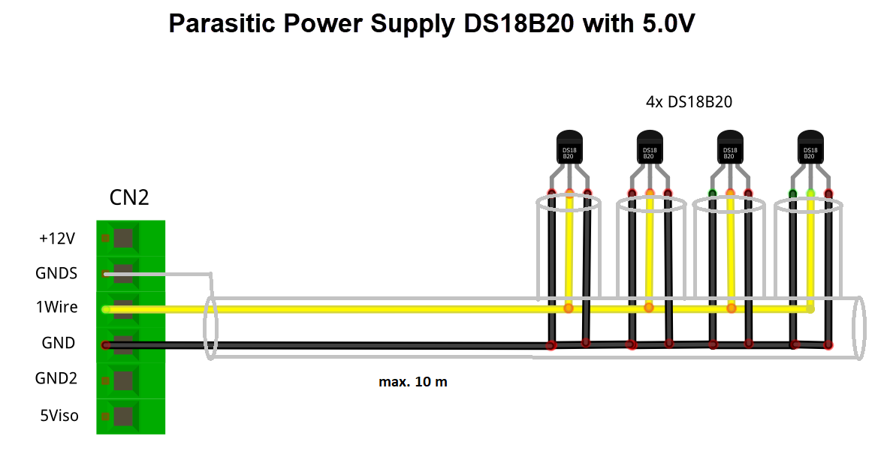
Abb.: 1Wire-Anbindung von externen Temperatur-Sensoren (parasitär versorgt)

Die Belegung der DS18B20-Temperatur-Sensoren ist folgendermaßen durchzuführen.

+--------+--------------------+
|Ausgang |Temperatursensor    |
+========+====================+
|1Wire   |gelb, Datenleitung  |
+--------+--------------------+
|GND     |schwarz + rot       |
+--------+--------------------+
|GNDS    |Schirm              |
+--------+--------------------+

.. note::
    Verwenden Sie für die Verkabelung externer Temperatur-Sensoren möglichst geschirmte Kabel und führen Sie den Schirm direkt bis zum Sensor. Verbinden Sie den Schirm des Sensorkabels **nicht** mit ``GND``, da Sie damit Masseschleifen erzeugen. Der gesamte Schirm der Busleitung darf nur einseitig an Eingang ``GNDS`` des 1Wire-Bus am OBP40 aufgelegt werden. Der Schirm am anderen Ende der Leitung bleibt offen. Andere Schirmeingänge dürfen nicht benutzt werden. Halten Sie Stichleitungen vom Bus zu den Sensoren möglichst kurz. Die maximale Anzahl der Sensoren am 1Wire-Bus ist auf 8 Sensoren begrenzt. Die Ausleszeit eines Sensors ist von der Anzahl (N) der Sensoren im Bus abhängig. Die Auslesezeit T lässt sich über folgende Formel berechnen: T[s]=N*1s.  
    
.. hint::
    Wenn möglich, verwenden Sie Temperatursensoren am I2C-Bus statt am 1Wire-Bus. Sie erhöhen damit die Betriebssicherheit des Gesamtsystems, da der I2C-Bus gegenüber der Außenwelt isoliert ist.
    
.. hint::
    Im Internet-Handel sind Nachbauten von DS18B20-Temperatur-Sensoren im Umlauf, die eine parasitäre Stromversorgung nicht unterstützen. Wenn Sie keine Kommunikation mit dem OBP40 zustande bekommen, dann probieren Sie andere Sensoren aus. Wenn auch das zu keinem Erfolg führt, benutzen Sie eine normale Stromversorgung für die Temperatursensoren. Mit dieser Art der Stromversorgung sollten nahezu alle Sensoren funktionieren.
	
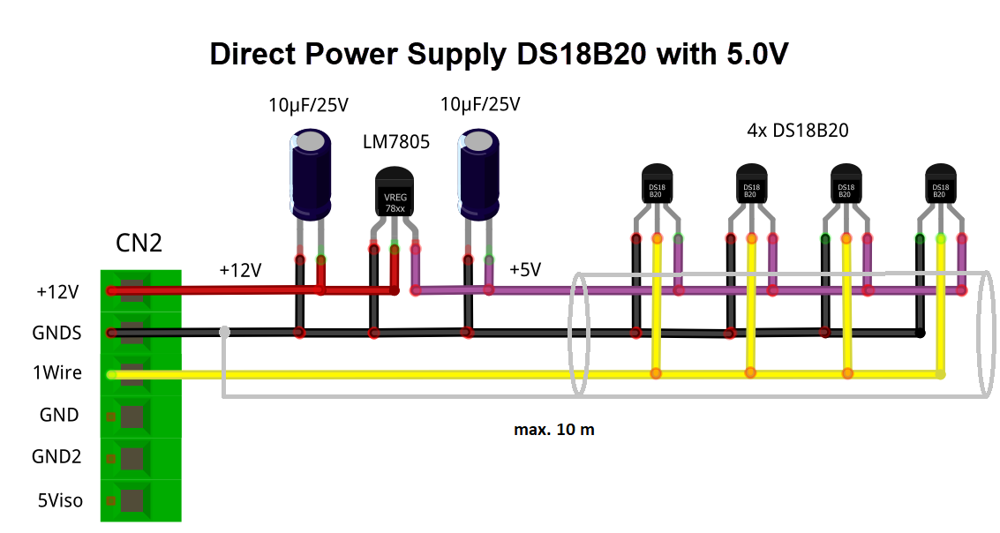
Abb.: 1Wire-Anbindung von externen Temperatur-Sensoren (direkt versorgt)

.. caution::
    Der 1Wire-Bus ist nicht isoliert gegenüber der internen Schaltung des OBP40. Das erhöht bei unsachgemäßer Installation das Risiko, dass eingekoppelte Störungen in die Busleitungen die Funktion und Stabilität des OBP40 beeinträchtigen können. Halten Sie daher die Buslänge so kurz wie möglich. Im schlimmsten Fall kann das zum kompletten Ausfall des OBP40 führen mit daraus resultierenden schweren Folgen für die Navigationsfähigkeit Ihres Bootes.
    
.. danger::
    Es darf auf keinen Fall eine Spannung von 12V an den Ausgang ``1Wire`` angelegt werden. Das hat unmittelbar zur Folge, dass das OBP40 beschädigt oder sogar zerstört wird.
    
USB
---

Die USB-C-Schnittstelle im OBP40 dient zum Flashen der Firmware und zum Debugging. Die USB-Schnittstelle ist als serielle Schnittstelle ausgeführt. Darüber hinaus kann auch eine bidirektionale, voll duplex-fähige NMEA0183-Kommunikation zu anderen Geräten wie einem Laptop, PC oder einem Marine Control Server aufgebaut werden.

**Spezifikation USB im OBP40**

* Serielles, bidirektionales asynchrones Datenprotokoll auf Binär-Basis
* Punkt zu Punkt (nicht isoliert)
* USB-OTG (serielles Device)
* Voll duplex
* Bus-Terminierung über PullUp-Widerstand im ESP32
* Unterstützte Protokolle
	* USB 1.1, TTL 3.3V
* Datenrate 1 MBit/s
* Stromversorgung des OBP40 über USB möglich
* Stromversorgung von externen Geräten aus dem OBP40 heraus nicht möglich
* Buslänge bis zu 3 m
* Kabelart geschirmt
* Steckerart USB-C

.. note::
	Für Linux und Win10/11 sind entsprechende USB-Treiber im Betriebssystem integriert. Für die älteren Win7/8-Versionen benötigen Sie `zusätzliche Treiber`_, um die USB-Schnittstelle benutzen zu können.
	
.. _zusätzliche Treiber: https://github.com/kutukvpavel/Esp32-Win7-VCP-drivers

**Stromversorgung**

Das OBP40 kann auch über USB-C mit Strom versorgt werden. Das ist nützlich, wenn man z.B. Software-Entwicklung durchführt und das Gerät am Schreibtisch nutzen möchte. Das stromliefernde Gerät muss bis zu 1 A mit einer Spannung von 5.1 V bereitstellen können, wie etwa ein Raspberry Pi Netzteil.
		
**Kommunikation** 

Die USB-C-Schnittselle kann zur voll duplexfähigen NMEA0183-Kommunikation mit weiteren Geräten verwendet werden. Denkbar wären folgende Nutzungs-Szenarien:

* Kommunikation mit einem Marine Control Server
* Datenlieferant für ein Android-Autoradio als Plotter
* Kommunikation mit einem Laptop oder PC zur Softwareentwicklung, Diagnose und zum Flashen der Firmware
* Diagnose der Buskommunikation mit externer Software wie dem `Actisense Reader`_
* Einspeisung von Simulationsdaten in die Bussysteme mit dem `NMEA-Simulator`_

.. _Actisense Reader: https://actisense.com/acti_software/nmea-reader/
.. _NMEA-Simulator: https://www.kave.fi/Apps/index.html

