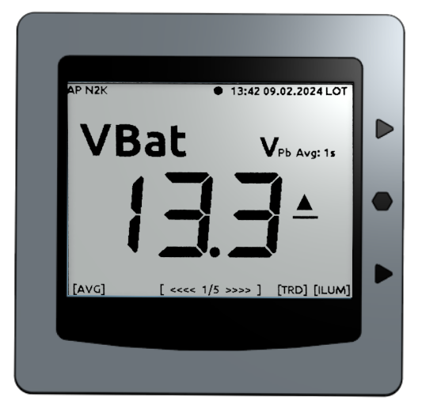

Bedienelemente
==============

             
Statuszeile
-----------

Die Statuszeile dient zur Anzeige von Statusinformationen. Dazu zählen:

**Zustandsanzeige des Access Points**
   * **AP** - Access Point
   
**Zustandsanzeige aktiver Bussysteme und Komponenten**
   * **N2K** - NMEA2000
   * **183** - NMEA0183
   * **USB** - NMEA0183 via USB
   * **TCP** - NMEA0183 via TCP (WiFi)
   * **GPS** - GPS-Sensor des OBP40 (Position gefunden)

* Lebenszeichen (pulsierender Punkt)
* Datum und Uhrzeit (landesspezifisch)
* Anzeige der Zeitzone

   * **UTC** - Weltzeit
   * **LOT** - Lokalzeit

Die Statuszeile ist in allen Anzeigeseiten zu sehen, sie zeigt den aktuellen Status des Gerätes an.

.. note::
   Der Anzeigeinhalt eines E-Paper Displays bleibt beim Ausschalten des Gerätes erhalten. Der pulsierende Punkt in der Statuszeile kennzeichnet das Gerät als aktiv. Sollte der Punkt nicht blinken, so ist die Software inaktiv oder das Gerät wurde ausgeschaltet.
   
Anzeigebereich
--------------

Im mittleren Bereich befindet sich der Anzeigebereich. Dort werden alle relevanten Informationen angezeigt. Bei jedem Wechsel auf eine neue Seite wird der Inhalt des Anzeigebereichs verändert. Die Aktualisierung des Anzeigebereichs erfolgt jede Sekunde als partieller Bild-Refresh.

Bedingt durch die E-Paper Technologie sind im Display nach einiger Zeit Geisterbilder von alten Anzeigezuständen zu sehen. Um die Geisterbilder zu entfernen, wird in regelmäßigen Abständen von 10 min ein Voll-Refresh der Anzeige durchgeführt. Dabei wird der komplette Bildinhalt mehrmals invertiert, dann gelöscht und anschließend neu geschrieben. Man erkennt einen Voll-Refresh am kurzen Flackern der Anzeige. Das gleiche passiert 4 Sekunden nach einem Seitenwechsel. Dadurch kann man schnell mehrere Anzeigeseiten nacheinander aufrufen. Erst bei der zuletzt aufgerufenen Seite wird nach 4 Sekunden ein Voll-Refresh durchgeführt, damit werden Geisterbilder alter Anzeigeseiten entfernt. Der regelmäßige Voll-Refresh ist per Default eingestellt und kann bei Bedarf über die Konfiguration deaktiviert werden.

Die Entstehung von Geisterbildern ist von der Display-Temperatur des OBP40 abhängig. Bei niedrigen Temperaturen sind Geisterbilder deutlicher zu sehen und die Anzeige reagiert träger als bei hohen Temperaturen. Kurz nach dem Einschalten wird für die ersten 5 Minuten jede Minute ein Voll-Refresh durchgeführt, damit sich das Display akklimatisieren kann.

.. note::
    Bei extrem hoher Sonneneinstrahlung kann es vorkommen, dass der Kontrast des Display-Inhaltes verloren geht. Schwarze Anzeigebereiche werden dann nur noch grau dargestellt. Das Display ist in dem Fall nicht defekt. Nach einem Voll-Refresh regeneriert sich das Display und der Kontrast wird wieder vollständig hergestellt.
   
Fußzeile
---------

Die Fußzeile dient zur Bezeichnung der Tastenfunktionen. Die Belegung der Tasten ändert sich abhängig vom Inhalt der Anzeigeseiten. Aktive Tasten sind mit Kurzbezeichnungen in eckigen Klammern versehen wie z.B. ``[AVG]``. Es kann auch Anzeigeseiten geben, die keine Tastenfunktionen enthalten. In der Mitte der Fußzeile werden weitere Informationen eingeblendet:

* ``[ <<<< 1/5 >>>> ]`` - Wischgeste aktiv
* ``[ Keylock active ]`` - Tasten gesperrt

Sofern die Wischgeste aktiv ist, werden im Infobereich die aktuelle Seite und die Seitenanzahl angezeigt. 

Jogdail-Wählrad und Tasten
--------------------------

.. image:: ../pics/OBP40_Side_View_Buttons_2_t.png
             :scale: 45%

Das OBP40 hat ein Jogdail-Wählrad und zwei Tasten am rechten Displayrand. Über das Wählrad lassen sich die Seiten auswählen. Mit den Tasten können auf einigen Seiten Änderungen durchgeführt werden. Folgende Funktionen stehen zur Verfügung:

* **Wählrad drehen nach oben** - Seite zurück
* **Wählrad drehen nach unten** - Seite vorwärts
* **Wählrad drücken** - Sleep-Mode an/aus
* **Taste oben** - Seitenspezifische Funktion
* **Taste unten** - Seitenspezifische Funktion

.. note::
   Das Jogdail-Wählrad kann nur gedrückt werden, wenn sich das Wählrad in Mittenposition bzw. Ruhestellung befindet.

Reset-Taster
------------

.. image:: ../pics/OBP40_Back_Side_2_t.png
             :scale: 45%

Der Reset-Taster befindet sich auf der Rückseite des Displays oben rechts hinter einem kleinen Loch. Der Reset-Taster wird im normalen Betrieb nicht genutzt. Bei Programmiervorgängen kann es nützlich sein, einen manuellen Reset auszulösen. Benutzen Sie zum Auslösen des Reset einen nicht leitenden, schmalen Gegenstand und drücken Sie den Taster vorsichtig, bis der Druckpunkt spürbar überwunden ist.

.. warning::
   Verwenden Sie keine leitenden Gegenstände. Damit können Kurzschlüsse auf der Platine ausgelöst werden, das Gerät kann dadurch beschädigt werden.
