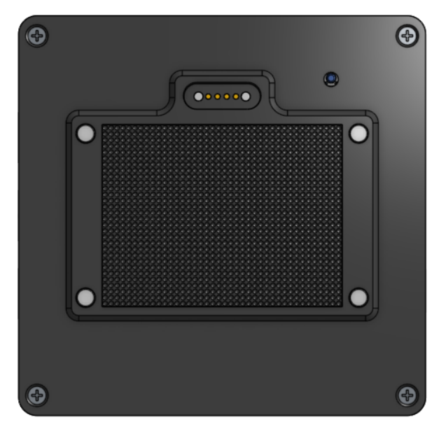

Funktionsweise
==============

Bedienkonzept
-------------

Das OBP40 kann sowohl als eigenständiges mobiles Gerät als auch als stationäres Gerät in einer Docking-Station betrieben werden. Um es als mobiles Gerät verwenden zu können, muss ein optionaler LiPo-Akku in das OBP40 eingebaut werden. Der Akku lässt sich lokal am Gerät über die USB-Buchse an der linken Seite und über die Docking-Sation aufladen. Zum Aufladen in der Docking-Station befindet sich auf der Rückseite des OBP40 ein Magnet-Dock. Als mobiles Gerät kann das OBP40 bis zu 8,5 Stunden autark betrieben werden. Sollte die Batteriespannung unter eine kritische Mindestspannung fallen, geht das OBP40 automatisch in den Tiefschlaf, um Strom zu sparen und den Akku zu schonen.

Befestigung
-----------

Das OBP40 kann auf verschiedene Arten befestigt werden. Dabei werden Metallboote als auch Kunhststoffboote berücksichtigt.

* Befestigung über Magnete auf Metallflächen und in der Docking-Station
* Befestigung über Klettband an beliebigen Oberflächen und in der Docking-Station
* Befestigung über Magnete an Halteplatte
* Befestigung über Klettband an der Halteplatte

Abb.: Rückseite OBP40 mit Magnet-Dock und Klettband

Abb.: Auflagefläche Docking-Station

Abb.: Halteplatte

Grundsätzlich bestehen zwei Möglichkeiten der Befestigung. Entweder über Magnete oder über Klettband. Je nach Situation kann man sich für eine der beiden Möglichkeiten entscheiden oder beides gleichzeitig benutzen. Das Klettband mit der Größe 50 x 40 mm bietet ausreichend Haftkraft und kann auf beliebigen Oberflächen verwendet werden. Wer feste Positionen für das OBP40 bevorzugt, kann die Halteplatte verwenden. Damit ist eine exakte Ausrichtung des Anzeigegerätes zu anderen Geräten möglich. Das OBP40 zentriert sich selbständig über die konische Vertiefung in der Halteplatte. Die Halteplatte kann optional mit einem Magnet-Dock ausgestattet werden, über das das OBP40 mit Strom versorgt werden kann.

.. warning::
	Als Befestigungsmagnete werden starke Neodym-Magnete verwendet, die das Erdmagnetfeld am Kompass verzerren können. Halten Sie einen Mindestabstand von 2 m zu Kompassen ein und prüfen Sie die Deviationstabelle auf zusätzliche Abweichungen. Das betrifft auch elektronische Kompasse.
	
.. note::
	An den äußeren beiden Federkontakten des Magnet-Dock liegt eine Versorgungsspannung von 5V an. Die inneren beiden Federkontakte übertragen die USB-Daten. Vermeiden Sie Kurzschlüsse mit metallischen Gegenständen an der Kontakten und schützen Sie die Kontakte vor Feuchtigkeit. 

WiFi-Verbindung
---------------

Die Datenübertragung im mobilen und stationären Betrieb erfolgt ausschließlich über eine WiFi-Verbindung im 2.4 GHz Funkbereich. Das OBP40 bezieht seine Daten über NMEA0183 als TCP-Datenstrom von anderen Geräten. Als Datenquellen können ein OBP60, ein M5Stack, SignalK, AvNav oder andere Quellen benutzt werden.

Gateway
-------

.. image:: ../pics/NMEA_Gateway.png
             :scale: 20%

Im OBP40 ist ein Gateway integriert, das Daten zwischen NMEA0183 und NMEA2000 bidirektional austauschen kann. Dabei werden die Daten des einen Busses in die Daten des anderen Busses übersetzt. Die Übersetzung funktioniert dabei in beide Richtungen.

.. note::
   Dabei ist zu beachten, dass nicht alle NMEA2000-Daten in NMEA0183-Daten übersetzt werden können, weil dafür nicht immer geeignete Telegramme in NMEA0183 existieren.

Konfiguration
-------------

Das OBP40 hat einen Access Point und einen kleinen Webserver integriert, mit denen das Gerät konfiguriert werden kann. Im Gegensatz zu anderen kommerziellen Geräten erfolgt die Konfiguration des OBP40 ausschließlich webbasiert. Dazu kann z.B. ein Handy benutzt werden. So ist die Konfiguration des Gerätes deutlich einfacher und komfortabler. Im Gerät lassen sich bis zu 10 Anzeigeseiten frei definieren. Der Anwender kann zwischen numerischen und grafischen Anzeigeseiten auswählen. Für jede numerische Anzeigeseite können beliebige Daten der Bussysteme angezeigt werden. Bei den grafischen Anzeigeseiten sind die Dateninhalte vorgegeben, da sie spezielle Funktionalitäten bieten.

Anzeige und Bedienung
---------------------

.. image:: ../pics/OBP40_Side_View_Buttons_2_t.png
             :scale: 50%

Als Anzeige wird ein E-Paper Display verwendet. Es besitzt einen hohen Kontrast und eine gute Ablesbarkeit auch bei starkem Sonnenlicht. Zudem verbraucht es sehr wenig Energie.

Die Auswahl der Anzeigeseiten erfolgt über ein Jogdail-Auswahlrad mit Druckpunkt und zwei zusätzliche Tasten an der rechten Seite. Je nach Anzeigeseite können einige Einstellungen auch über die Tasten vorgenommen werden. Die Einstellungen gelten dann ausschließlich für die Anzeigeseite und werden gespeichert, sodass die Einstellungen beim Seitenwechsel erhalten bleiben.

USB-Ports
---------

Das OBP40 verfügt auf der linken Seite über einen USB-Port, der parallel über Kontakte auf der Rückseite auf die Docking-Station übertragen wird. Die Docking-Station verfügt über ein eigenes USB-Kabel, das mit anderen Geräten verbunden werden kann. Solange sich das OBP40 in der Docking-Station befindet, erfolgt die USB-Verbindung über das USB-Kabel der Docking-Station.

.. hint::
	Es darf nur eine USB-Verbindung zum OBP40 bestehen. Verwenden Sie entweder die linke USB-Buchse am OBP40 **oder** das USB-Kabel der Docking-Station. Beide USB-Verbindungen dürfen nicht gleichzeitig benutzt werden.

Erweiterungsport
----------------

.. image:: ../pics/CrowPanel_4.2_ESP32_HMI_E-paper_Display.png
   :scale: 50%
   
Abb.: Platinen-Anschlussbelegung

Die Platine verfügt über einen 20-poligen GPIO-Erweiterungsport an der oberen Seite. Darüber lässt sich optional Zusatzhardware anschließen wie z.B.:

* CAN-Bus (NMEA0183)
* RS485-Bus (NMEA0183)
* I2C-Bus
* 1Wire-Bus
* Buzzer
* GPS-Empfänger (RS232)
* Analoger Eingang zur Spannungsmessung

Um einen Datenaustausch über NMEA2000 oder NMEA0183 zu ermöglichen, werden optionale Zusatzmodule benötigt, die am Erweiterungsport angeschlossen werden müssen. Der I2C- und 1Wire-Bus können dagegen direkt benutzt werden. Details zur Belegung des GPIO-Erweiterungsports finden Sie im Kapitel :ref:`GPIO-Erweiterungsport`.

.. warning::
	Der Anschluss von Zusatzhardware erfordert Kenntnisse in Elektronik, um die Zusatzhardware korrekt anschließen zu können. Die Signalpegel an der Anschlüssen dürfen 3.3 V nicht übersteigen und es ist darauf zu achten, ob die Anschlüsse als Eingang oder Ausgang verwendet werden. Die herausgeführten Anschlüsse sind ungeschützt. Der Prozessor kann bei falscher Benutzung der Anschlüsse irreparabel beschädigt werden.