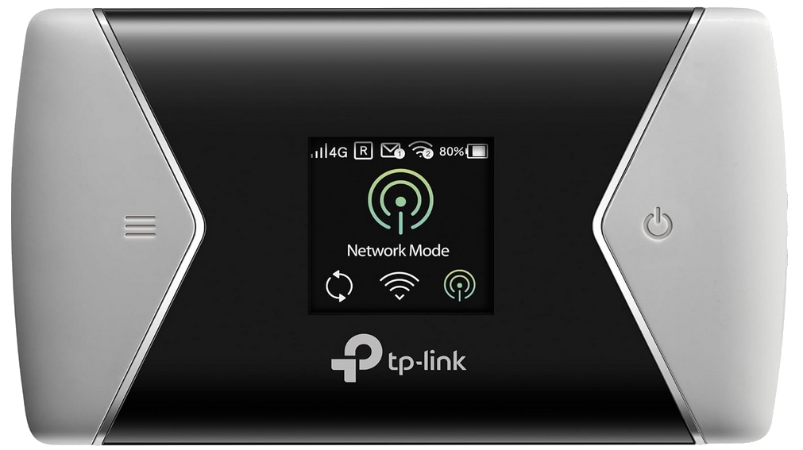
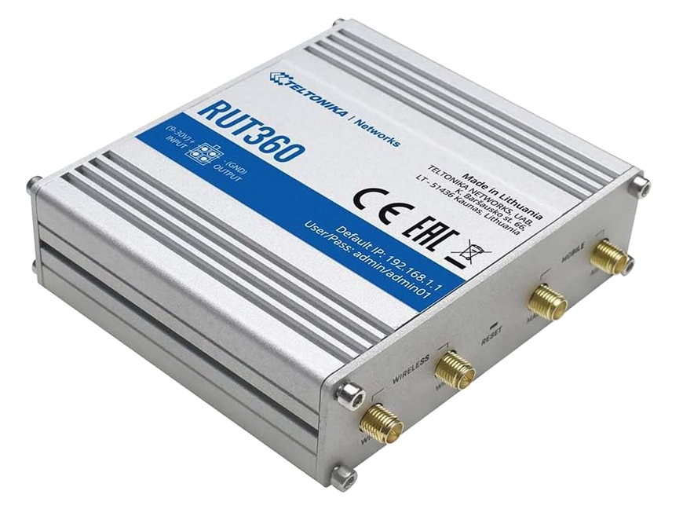
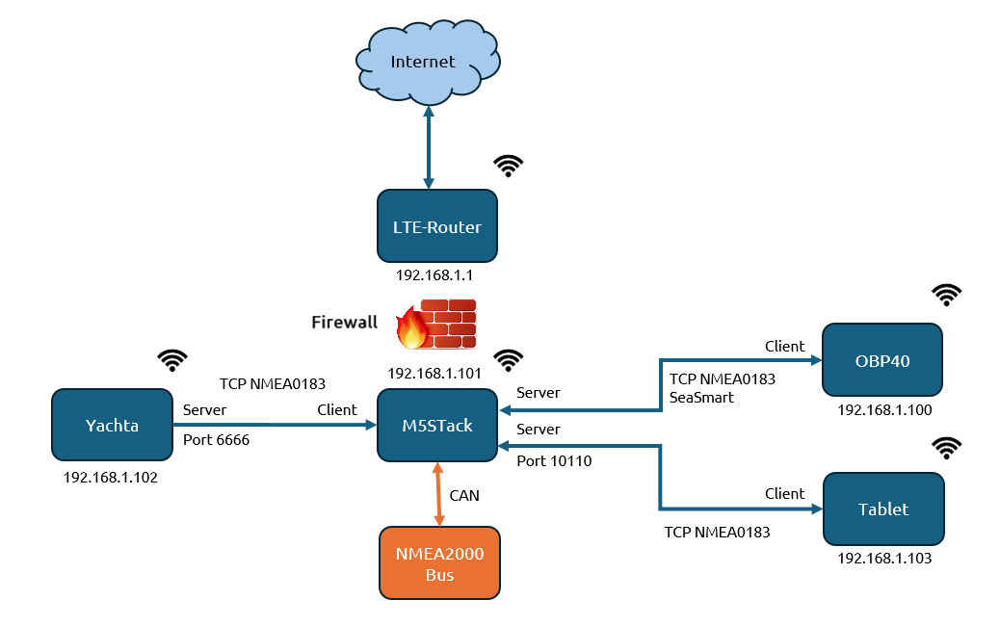
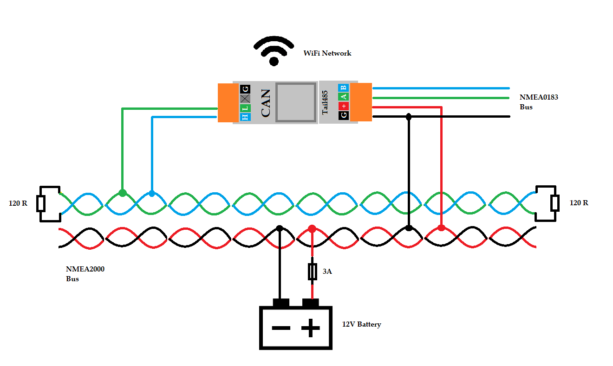

Beispielkonfiguration
=====================

OBP40 Yachta M5Stack AvNav
--------------------------

Im folgenden Beispiel wird gezeigt wie man mit einem **OBP40** eine Datenübertragung zum **Windsensor Yachta** und zu einem **M5Stack ATOM CAN** mit `NMEA2000-Gateway`_ aufbauen und die Daten in der Navigationsapp AvNav auf einem Tablett nutzen kann. Die M5Stack ATOM CAN dient dabei als zentrale Datenbasis, in der alle Daten zusammenlaufen. Die Datenübertragung erfolgt über WiFi-Netzwerkverbindungen, die ein LTE-Router zur Verfügung stellt. Der Vorteil eines LTE-Routers besteht darin, dass sie alle Geräte an Bord mit einer WiFi-Internetverbindung versorgen können und die Geräte im WiFi-Netzwerk untereinander kommunizieren können. Der LTE-Router schottet das eigene WiFi-Netzwerk gegenüber dem Internet ab, so dass von außerhalb niemand auf Ihr internes Netzwerk Zugriff erhält. Somit lassen sich auch Geräte wie Handys, Tabletts oder Laptops an Bord mit dem Internet verbinden und alle Geräte haben Zugriff auf die Daten der Sensoren und können über einen Web-Browser darauf zugreifen. Die Naviationssoftware AvNav wird dabei auf einem Android-Tablett installiert und zur Navigation genutzt.

.. _NMEA2000-Gateway: https://open-boat-projects.org/de/nmea2000-gateway-mit-m5stack-atom/

.. tip::
	Grundsätzlich ließe sich der Access Point vom M5Stack auch als zentraler WiFi-Router nutzen. Die Leistungsfähigkeit ist aber deutlich geringer als bei einem LTE-Router. Wir empfehlen ausdrücklich die Verwendung eines dedizierte LTE- oder WiFi-Routers. Sie vermeiden damit Probleme bei der Kommunikation der Geräte untereinander.

Abb.: Beispielkonfiguration OBP40, Yachta, M5Stack, AvNav

Die Konfiguration läuft in folgenden Schritten ab:

* LTE-Router einrichten
* M5Stack mit NMEA2000-Netzwerk und Windsensor Yachta verbinden
* OBP40 mit M5Stack verbinden
* AvNav mit dem M5Stack verbinden

LTE-Router einrichten
^^^^^^^^^^^^^^^^^^^^^

Als LTE-Router können Sie sowohl mobile Geräte als auch stationäre Geräte verwenden. Mobile Geräte haben den Vorteil, dass sie autark über eine Batterie über einen längeren Zeitraum funktionieren und auch außerhalb des Bootes an Land bei Ausflügen benutzt werden können. Stationäre Geräte bieten sich an, wenn man maximale Empfangsleistung benötigt und in Küstennähe unterwegs ist und große Entfernungen zur nächsten Mobilfunk-Basisstation überbrücken möchte. In solchen Fällen bietet es sich an, Mobilfunkantennen oben im Mast zu installieren und die Antenne per Kabel mit dem stationären Router zu verbinden.

.. tip::
	Achten Sie beim Kauf des LTE-Routers, dass der Router im Dualband-Modus in den zwei WiFi-Frequenzbereichen 2.4 GHz und 5 GHz **gleichzeitig** arbeiten kann und über 4G/5G-Mobilfunk-Standard verfügt. So profitieren sie von einer leistungsfähigen Internet- und WiFi-Verbindung im 5 GHz Bereich und umgehen die meist überfüllten 2.4 GHz Frequenzbereiche. Solche Router können Daten zwischen beiden Frequenzbereichen problemlos austauschen. Ein ausgedientes Handy im Hotspot-Mode leistet ähnliches wie ein LTE-Router und kann eine günstige Alternative darstellen.

Abb.: Mobiler 4G-LTE-Dualband-Router TP-Link M7450

	* Leistungsdaten
		- 4G/LTE Mobilfunkstandard 50 MBit/s
		- WiFi Dualband 2.4 GHz **oder** 5 GHz 300 MBit/s [#f2]_
		- 3000 mAh LiPo-Akku
		- 15 Stunden autarke Laufzeit
		- 32 WiFi-Geräte einbindbar
		- 32 GB SD-Card-Speicher
		- USB-, SMB- und FTP-Share für Filme und Musik von SD-Card
		- `Dokumentation <../_static/m7450.pdf>`_
	.. [#f2] Kein gleichzeitiger Dualbetrieb möglich

.. warning::
	Der LTE-Router TP-Link M7450 kann nicht gleichzeitig in beiden Frequenzbändern arbeiten. Daher müssen Sie den TP-Link M7450 fest auf das Frequenzband 2.4 GHz einstellen. Das OBP40 und der M5Stack ATOM CAN arbeiten nur im 2.4 GHz Bereich.
	
		

Abb.: Stationärer 4G-LTE-Dualband-Router RTU360

	* Leistungsdaten
		- 4G/LTE Mobilfunkstandard 50 MBit/scale
		- WiFi Dualband 2.4 GHz und 5 GHz 300 MBit/s
		- 2x LAN CAT6 100 MBit/s
		- Externe Antennen für LTE und WiFi
		- 12V Versorgungseingang
		- 230V AC-Netzteil
		- `Online-Dokumentation`_
		- `Quick-Installation Guide`_
		
.. _Online-Dokumentation: https://wiki.teltonika-networks.com/view/RUT360_Manual
.. _Quick-Installation Guide: https://wiki.teltonika-networks.com/view/QSG_RUT360

Der verwendete LTE-Router wird entsprechend der Bedienungsanleitung in Betrieb genommen. Für eine Internetverbindung benötigen Sie einen Mobilfunk-Datenvertrag. Die meisten Mobilfunkfirmen bieten preisgünstige Datentarife an. Empfehlenswert sind Volumenverträge, die ein festes Datenvolumen für eine vorgegebene Zeitdauer bieten. Wählen Sie einen Tarif aus, der Ihrem Datenverbrauch entspricht. Das Datenvolumen können Sie ebenfalls in allen Ländern der EU uneingeschränkt nutzen, so wie Sie das in Ihrem Heimatland gewohnt sind.

Für das Konfigurationsbeispiel wird davon ausgegangen, dass die Geräte folgende IP-Adressen vom Router zugewiesen bekommen:

	* MyBoat - WiFi-SSID
	* MySecret - WiFi Passwort
	* 192.168.1.1   - LTE-Router
	* 192.168.1.100 - OBP40
	* 192.168.1.101 - M5Stack
	* 192.168.1.102 - Windsensor Yachta
	* 192.168.1.103 - Android-Tablett mit AvNav

.. hint::
	In Ihrem konkreten Fall können die IP-Adressen abweichen. Verwenden Sie dann die IP-Adressen, die den Geräten vom Router zugewiesen worden sind.

Datenübertragung
^^^^^^^^^^^^^^^^

Das folgende Schema zeigt die Datenübertragung und welche Geräte Server oder Client bei der Datenübertragung sind.

Abb.: Schema Datenübertragung
	
Konfiguration M5Stack
^^^^^^^^^^^^^^^^^^^^^

Abb.: M5Stack ATOM CAN mit ATOM Light

Bevor der M5Stack ATOM CAN benutzt werden kann, muss er mit der NMEA2000-Gateway-Firmware geflasht sein. Der M5Stack ist eine Kombination aus `ATOM CAN`_ und einer ATOM-Controllereinheit. Als ATOM-Controller kann ein `ATOM Light`_ oder ein `ATOM-S3 Light`_ verwendet werden. Je nach verwendeter Controllereinheit folgen Sie den Anweisungen zum Flashen der NMEA2000-Gateway-Firmware auf der `Projekt-Homepage`_ des NMEA2000-Gateways.

.. _ATOM CAN: https://docs.m5stack.com/en/atom/atom_can
.. _ATOM Light: https://docs.m5stack.com/en/core/ATOM%20Lite
.. _ATOM-S3 Light: https://docs.m5stack.com/en/core/AtomS3%20Lite
.. _Projekt-Homepage: https://www.wellenvogel.net/software/esp32/install.html

Der M5Stack ATOM CAN wird der Systemname M5Stack zugewiesen und mit dem WiFi-Netzwerk des LTE-Routers verbunden. Der TCP-Server ist so konfiguriert, dass zum OBP40 und zum Tablett Daten übertragen werden können. Die TCP-Client-Verbindung dient zur Kommunikation mit dem Windsensor Yachta. Der M5Stack ist per Kabel über die CAN-Unit mit dem NMEA2000-Netzwerk des Bootes verbunden. Sensordaten die im M5Stack vorliegen, wie z.B. die Windsensor-Daten, werden auch in den NMEA2000-Bus übertragen.

Nehmen Sie folgende Einstellungen vor:

+---------------------------+---------------------+
|Einstellung                |M5Stack              |
+===========================+=====================+
|:ref:`Config - System`     |                     |
+---------------------------+---------------------+
|System Name                |M5Stack              |
+---------------------------+---------------------+
|:ref:`Config - WiFi Client`|                     |
+---------------------------+---------------------+
|WiFi Client                |on                   |
+---------------------------+---------------------+
|WiFi Client SSID           |MyBoat               |
+---------------------------+---------------------+
|WiFi Client Password       |MySecret             |
+---------------------------+---------------------+
|:ref:`Config - Converter   |                     |
+---------------------------+---------------------+
|NMEA2000 Out               |on                   |
+---------------------------+---------------------+
|:ref:`Config - TCP Server` |                     |
+---------------------------+---------------------+
|TCP Port                   |10110                |
+---------------------------+---------------------+
|NMEA0183 Out               |on                   |
+---------------------------+---------------------+
|NMEA0183 In                |on                   |
+---------------------------+---------------------+
|To NMEA2000                |on                   |
+---------------------------+---------------------+
|SeaSmart Out               |on                   |
+---------------------------+---------------------+
|:ref:`Config - TCP Client` |                     |
+---------------------------+---------------------+
|Enable                     |on                   |
+---------------------------+---------------------+
|Remote Port                |6666                 |
+---------------------------+---------------------+
|Remote Address             |192.168.1.102        |
+---------------------------+---------------------+
|NMEA0183 Out               |off                  |
+---------------------------+---------------------+
|To NMEA2000                |on                   |
+---------------------------+---------------------+
|SeaSamart Out              |off                  |
+---------------------------+---------------------+

Nach der Konfiguration sollten Sie im Status nachfolgende Informationen sehen. Der M5Stack ist als WiFi-Client beim LTE-Router angemeldet und hat die IP-Adresse 192.168.1.101 zugewiesen bekommen. Der M5Stack ist als TCP-Client mit dem Windsensor Yachta verbunden. Über diese Verbindung werden Winddaten als NMEA0183-Telegramme empfangen. Unter Clients werden die Anzahl der Geräte angezeigt, die als TCP-Client mit dem M5Stack verbunden sind. Wenn das OBP40 und das Tablet mit dem M5Stack verbunden ist, sollten 2 Geräte angezeigt werden. Der NMEA2000-Status wird als Online angezeigt, wenn Daten mit dem NMEA2000-Bus ausgetauscht werden. Die NMEA2000-Daten werden mit SeaSmart zum OBP40 über die WiFi-Verbindung übertragen. Die Anzahl der ausgetauschten NMEA2000-Telegramme sieht man unter NMEA2000 In/Out. Wenn ein OBP40 oder ein Tablett mit dem M5Stack per TCP verbunden ist, sieht man die Anzahl der ausgetauschten NMEA0183-Telegramme unter TCP In/Out.

+---------------------------+---------------------+
|Statusmeldungen            |M5Stack              |
+===========================+=====================+
|:ref:`Status`              |                     |
+---------------------------+---------------------+
|WiFi Client Connected      |true                 |
+---------------------------+---------------------+
|WiFi Client IP             |192.168.1.101        |
+---------------------------+---------------------+
|#Clients                   |2                    |
+---------------------------+---------------------+		
|NMEA2000 State             |[0] Online           |
+---------------------------+---------------------+	
|NMEA2000 In                |Telegrammeanzahl     |
+---------------------------+---------------------+
|NMEA2000 Out               |Telegrammeanzahl     |
+---------------------------+---------------------+
|TCP In                     |Telegrammeanzahl     |
+---------------------------+---------------------+
|TCP Out                    |Telegrammeanzahl     |
+---------------------------+---------------------+

Die Verbindung des M5Stack mit dem NMEA2000-Netzwerk erfolgt über ein `Tail485`_. Das Tail485 kann am M5Stack angesteckt werden. Es enthält einen Spannungswandler, der die 12V-Versorgungsspannung so aufbereitet, dass damit der M5Stack versorgt werden kann. Die Spannung kann direkt vom NMEA2000-Bus entnommen werden. Zusätzlich haben Sie eine NMEA0183-Schnittstelle mit der Daten ausgetauscht werden können.

.. _Tail485: https://docs.m5stack.com/en/atom/tail485

Abb. CAN-Bus Anbindung mit Versorgung aus dem Bus (M5Stack mit Tail485)

Konfiguration OBP40
^^^^^^^^^^^^^^^^^^^

Dem Anzeigegerät OBP40 wird der Systemname OBP40V1 zugewiesen und mit dem WiFi-Netzwerk des LTE-Routers verbunden. Die TCP-Client-Verbindung dient zur Kommunikation mit dem M5Stack. Das OBP40 bezieht alle Sensor-Daten über den M5Stack. Die Daten vom Windsensor Yachta werden über den M5Stack bereitgestellt.

Folgende Einstellungen sind vorzunehmen:

+---------------------------+---------------------+
|Einstellung                |OBP40                |
+===========================+=====================+
|:ref:`Config - System`     |                     |
+---------------------------+---------------------+
|System Name                |OBP40V1              |
+---------------------------+---------------------+
|:ref:`Config - WiFi Client`|                     |
+---------------------------+---------------------+
|WiFi Client                |on                   |
+---------------------------+---------------------+
|WiFi Client SSID           |MyBoat               |
+---------------------------+---------------------+
|WiFi Client Password       |MySecret             |
+---------------------------+---------------------+
|:ref:`Config - TCP Client` |                     |
+---------------------------+---------------------+
|Enable                     |on                   |
+---------------------------+---------------------+
|Remote Port                |10110                |
+---------------------------+---------------------+
|Remote Address             |192.168.1.101        |
+---------------------------+---------------------+
|NMEA0183 Out               |on                   |
+---------------------------+---------------------+
|To NMEA2000                |off                  |
+---------------------------+---------------------+
|SeaSamart Out              |on                   |
+---------------------------+---------------------+

Nach der Konfiguration sollten Sie im Status nachfolgende Informationen sehen. Das OBP40 ist als WiFi-Client beim LTE-Router angemeldet und hat die IP-Adresse 192.168.1.100 zugewiesen bekommen. Das OBP40 ist als TCP-Client mit dem M5Stack verbunden. Über diese Verbindung können NMEA0183- und NMEA2000-Daten ausgetauscht werden. Der NMEA2000-Status wird als offline angezeigt, weil keine direkte Kabelverbindung zum NMEA2000-Netzwerk existiert. Die NMEA2000-Daten werden mit SeaSmart über die WiFi-Verbindung übertragen.

+---------------------------+---------------------+
|Statusmeldungen            |OBP40                |
+===========================+=====================+
|:ref:`Status`              |                     |
+---------------------------+---------------------+
|WiFi Client Connected      |true                 |
+---------------------------+---------------------+
|WiFi Client IP             |192.168.1.100        |
+---------------------------+---------------------+	
|#Clients                   |0                    |
+---------------------------+---------------------+	
|NMEA2000 State             |[32] Offline         |
+---------------------------+---------------------+	

Konfiguration Yachta
^^^^^^^^^^^^^^^^^^^^

Der Windsensor Yachta ist so konfiguriert, dass er im WiFi-Netzwerk des LTE-Routers eingebucht ist. Der Windsensor stellt über den Port 6666 dem M5Stack Winddaten zur Verfügung. Es werden dabei nur Daten vom Windsensor Yachta zum M5Stack übertragen. 

Folgende Einstellungen werden für den Windsensor Yachta vorgenommen:

+---------------------------+---------------------+
|Einstellung                |Yachta               |
+===========================+=====================+
|**Network Settings**       |                     |
+---------------------------+---------------------+
|WLAN Client SSID           |MyBoat               |
+---------------------------+---------------------+
|WLAN Client IP             |MySecret             |
+---------------------------+---------------------+
|Connection Timeout         |30s                  |
+---------------------------+---------------------+
|WLAN Sever SSID            |Yachta               |
+---------------------------+---------------------+
|WLAN Server Password       |********             |
+---------------------------+---------------------+
|AP Channel                 |1                    |
+---------------------------+---------------------+
|Server Mode                |HTTP (JSON/NMEA)     |
+---------------------------+---------------------+
|mDNS Service               |on                   |
+---------------------------+---------------------+
|**Device Settings**        |                     |
+---------------------------+---------------------+
|Wind Sensor Type           |Yachta 2.0           |
+---------------------------+---------------------+

.. tip::
	Der Windsensor Yachta lässt sich in einen Demo-Mode versetzen. So kann die Funktionalität außerhalb des Bootes getestet werden. Der Windsensor liefert dann simulierte Winddaten. Über **Server Mode** kann der Simulationsmodus mit der Einstellung ``Demo Mode`` aktiviert werden.

Nach der Konfiguration sollten unter **Device Info** im Windsensor Yachta folgende Statusmeldungen zu sehen sein:

+---------------------------+---------------------+
|Statusmeldungen            |Yachta               |
+===========================+=====================+
|**Network Parameter**      |                     |
+---------------------------+---------------------+
|WLAN Client SSID           |MyBoat               |
+---------------------------+---------------------+
|WLAN Client IP             |192.168.1.102        |
+---------------------------+---------------------+
|Connection Quality         |>50%                 |
+---------------------------+---------------------+	

Tablett Konfiguration
^^^^^^^^^^^^^^^^^^^^^

Das Android-Tablett wird in das WiFi-Netzwerk des LTE-Routers hinzugefügt und anschließend die App AvNav aus dem Play-Sore installiert. Details zur Konfiguration entnehmen Sie dem Handbuch zum Tablett. Die Daten eines GPS-Empfängers im Tablett lassen sich ebenfalls im NMEA0183- und NMEA2000-Netzwerk nutzen.

+---------------------------+---------------------+
|Einstellung                |Android-Tablett      |
+===========================+=====================+
|**Einstellungen WiFi**     |                     |
+---------------------------+---------------------+
|WiFi                       |on                   |
+---------------------------+---------------------+
|WiFi Client SSID           |MyBoat               |
+---------------------------+---------------------+
|WiFi Client Password       |MySecret             |
+---------------------------+---------------------+
|App-Installation           |AvNav                |
+---------------------------+---------------------+

Nachfolgend wird gezeigt, wie man Busdaten über ein Tablett in AvNav nutzen kann. Die Datenübertragung erfolgt über WiFi. Das Tablett tauscht dabei die Daten mit dem M5Stack über einen TCP-Verbindung aus. Dabei wird das Tablett als TCP-Client an die M5Stack ATOM CAN angedockt. Unter AvNav wird die Verbindung als TCPReader eingerichtet.

Abb.: Startseite AvNav für Android

Unter AvNav klicken Sie auf der Startseite oben rechts das Symbol mit den 3 Strichen.

Sie gelangen dann auf die Seite zum Serverstatus. Dort können Sie über das Plus-Symbol weitere Verbindungen zum AvNavServer einrichten.

Für die bidirektionale Kommunikation über USB wählen Sie **TCPReader**.

Abb.: Verbindungstypen

Unter **IP-Address** tragen Sie die IP-Adresse des M5Stack ein und als **Port** die 10110. Um nicht nur Daten senden, sondern auch empfangen zu können, aktivieren Sie **SendOut**.

Abb.: Einstellungen zur TCPReader-Verbindung

Nach der Übernahme aller Daten ist die neue Verbindung im Server-Status als TCPReader-Verbindung zu sehen.

Abb.: Server-Status
