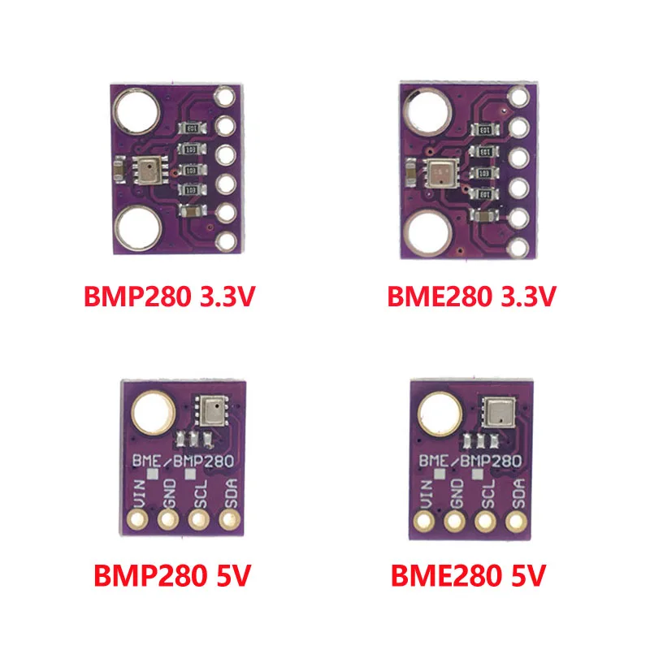
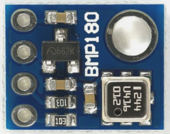

Erweiterte Sensorik
===================

Bei der erweiterten Sensorik handelt es sich um Sensoren, die nicht am NMEA0183-Bus und NMEA2000-Bus angeschlossen werden. Zusätzlich lassen sich preiswerte Sensoren am I2C-Bus und am 1Wire-Bus anschließen. Das OBP40 und OBP60 unterscheiden sich bezüglich der Spannungsbereiche für den I2C-Bus und der Isolation des Bussystems.

+-------+-----+----------+-----------+
| Typ   | Bus | Spannung | Isolation |
+=======+=====+==========+===========+
| OBP40 | I2C | 3.3V TTL | nein      |
+-------+-----+----------+-----------+
| OBP40 | 1W  | 3.3V TTL | nein      |
+-------+-----+----------+-----------+

+-------+-----+----------+-----------+
| Typ   | Bus | Spannung | Isolation |
+=======+=====+==========+===========+
| OBP60 | I2C | 5.0V TTL | ja        |
+-------+-----+----------+-----------+
| OBP60 | 1W  | 3.3V TTL | nein      |
+-------+-----+----------+-----------+

In der nachfolgenden Tabelle sind einige Sensoren aufgelistet, die am OBP40 und am OBP60 verwendet werden können.

.. warning::
	Die Sensormodule sind für bestimmte Spannungsbereiche ausgelegt. Achten Sie darauf, die richtigen Sensoren zu verwenden. Werden 3.3V-Module in 5V-Systemen benutzt, können die 3.3V-Module beschädigt werden. Es sind in diesem Fall Pegelkonverter notwendig. Die meisten 5V-Module sind auch an 3.3V-Systemen nutzbar, wenn sie mit 3.3V betrieben werden.

.. note::
	Beachten sie beim Einkauf der BMP280- und BME280-Module, unterschiedlieche Typen gibt die ähnlich aussehen, sich aber unterschiedlich verhalten. Sie erkennen die Typen an der Gehäusegröße und Form des Chips.

Abb.: Versionen BMP280/BME280	

+----------+-----+---------+---------+------+----+--------------------+
| Typ      | Bus | Sensor  | Bild    | 3.3V | 5V | Benutzte Pins      |
+----------+-----+---------+---------+------+----+--------------------+
| BMP085   | I2C | T, P    |         |  X   |    | Vin, SCL, SDA, GND |
+----------+-----+---------+---------+------+----+--------------------+
| BMP180   | I2C | T, P    ||B2|_    |  X   |    | Vin, SCL, SDA, GND |
+----------+-----+---------+---------+------+----+--------------------+

| BMP280   | I2C | T, P    | B3   |  X   |  X | Vin, SCL, SDA, GND |
| BME280   | I2C | T, P, H | B4   |  X   |  X | Vin, SCL, SDA, GND |
| SHT21    | I2C | T, H    | B5   |  X   |  X | Viin SCL, SDA, GND |
| SHT31    | I2C | T, H    | B6   |  X   |    | Vin, SCL, SDA, GND |
| HTU21    | I2C | T, H    | B7   |  X   |  X | Vin, SCL, SDA, GND |
| BMP280   | I2C | T, P    | B8   |  X   |    | Vin, SCL, SDA, GND |
| BME280   | I2C | T, P, H | B8   |  X   |    | Vin, SCL, SDA, GND |
| AS5600   | I2C | R       | B10  |  X   |    | VCC, SCL, SDA, GND |
| INA219   | I2C | U, I    | B11  |  X   |  X | VCC, SCL, SDA, GND |
| INA226   | I2C | U, I, W | B12  |  X   |  X | VCC, SCL, SDA, GND |
| SN65H230 | TTL | CAN     | B13  |  X   |    | 3.3, CRX, CTX, GND |
| SN65H230 | TTL | CAN     | B14  |  X   |    | 3.3, CRX, CTX, GND |
| DS18B20  | 1W  | T       | B15  |  X   |    | Vin, Data, GND     |

.. _B1: ../pics/Modul_BMP180.png

.. _B2: ../pics/Modul_BMP180.png

* T - Lufttemperatur
* P - Luftdruck
* H - Relative Luftfeuchtigkeit
* R - Rotation 0...360°
* U - Spannung
* I - Strom
* W - Leistung

.. list-table::
    :name: tab-beispieltabelle
    :header-rows: 1

    * - Typ
      - Bus
      - Senor
	  - Bild
	  - 3.3V
	  - 5.0V
	  - Benutzte Pins
    * - BMP085
      - I2C
      - T, P
	  - .. image:: ../pics/Modul_BMP085.png
	  - X
	  - O
      - Vin, SCL, SDA, GND
	* - BMP180
      - I2C
      - T, P
	  - .. image:: ../pics/Modul_BMP180.png
	  - X
	  - O
      - Vin, SCL, SDA, GND
    