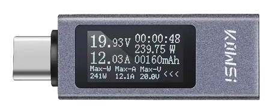

Inbetriebnahme
==============

Dieser Abschnitt hat die Erstinbetriebnahme Ihres OBP40 zum Inhalt. Dazu wird das Gerät mit Strom versorgt, um die ersten Einstellungen vorzunehmen. So können Sie die Funktionalität testen, bevor Sie das Gerät im Boot verwenden.

Stromversorgung USB-C
---------------------

Das OBP40 wird über USB-C mit Strom versorgt. Der USB-Anschluss muss aber ausreichend Spannung von 5 V und Strom bis 1 A liefern können. 

.. note::
	Viele USB-Computeranschlüsse verfügen nicht über einen ausreichend hohen Ausgangsstrom und teilen sich den Strom mit mehreren Anschlüssen. Das kann dazu führen, dass das OBP40 nicht direkt von einem PC aus mit Strom versorgt werden kann. Auch die Kabelqualität und Kabellänge ist entscheidend. Einige Kabel haben zu geringe Querschnitte und erzeugen einen hohen Spannungsabfall auf den Leitungen. Die Spannung ist dann am USB-C-Ausgang zu gering. Benutzen Sie in solchen Fällen passige Netzteile wie sie zum Laden von Handys oder Tablets benutzt werden.
	
Zum Testen, ob die USB-C-Versorgung genügend Spannung und Strom liefert, kann man ein **USB-C Diagnosegerät** verwenden. Das Diagnosegerät wird am Eingang des OBP60 angesteckt und das USB-C Stromversorgungskabel in das Diagnosegerät gesteckt. Auf dem Display kann die bereitgestellte Spannung und der aktuelle Stromverbrauch abgelesen werden. Die Spannung sollte bei mindestens 5.0 V liegen. Der Strom variiert dabei je nach Stromverbrauch.

.. hint::
	Je nach verwendeten USB-C Diagnosegerät kann es sein, dass nur die Stromversorgungspins angeschlossen sind aber keine Daten übertragen werden können. Wenn Sie eine Kommunikation über USB-C benötigen, müssen Sie das Diagnosegerät wieder entfernen.

Abb.: USB-C Diagnosegerät 

Ausschalten des OBP40
---------------------

Das OBP40 verfügt über keine separaten Ein/Aus-Schalter. Das Gerät wird einfach spannungslos gemacht, indem der USB-Stecker gezogen wird. Das Gerät schaltet sich dann aus.

.. note::
	Wenn Sie optional einen LoPo-Akku zur mobilen Verwendung benutzen, reicht es nicht das USB-Kabel zu ziehen, da das Gerät dauerhaft über den Akku mit Strom versorgt wird. Um das Gerat auszuschalten, kann das OBP40 in einen Tiefschlaf versetzt werden, indem Sie das Auswahlrad in der Mittenposition länger drücken, bis im Display die Info **Sleep Mode** erscheint. Das OBP40 befindet sich dann in einem energiesparenden Tiefschlaf. Je nach Akkuzustand kann der LoPo-Akku das OBP40 bis zu 1,3 Jahre im Tiefschlaf halten. Ein aufwecken des Gerätes ist durch erneutes drücken des Auswahlrades möglich. Das Gerät benötigt ungefähr 5s bis es vollständig gestartet ist.

Benutzung
---------

Das OBP40 kann mobil als auch stationär mit der Ladeschale verwendet werden. Wenn das OBP40 in der Ladeschale liegt, wird der Lipo-Akku automatisch geladen, sofern ein Lipo-Akku verwendet wird. Der Ladezustand des Akkus kann angezeigt werden, wenn zusätzlich ein Spannungsteiler zur Messung der Akkuspannung eingebaut worden ist. Die Firmware unterstützt die Funktionalität des Akkus und der Ladestandsanzeige, wenn in der Software die entsprechenden Kompiler-Flags gesetzt sind und die Firmware neu kompiliert und in das OBP40 übertragen wurde.

Die Ladezustandanzeige erfolgt in 20% Schritten und wird in der Statuszeile über im Akkusymbol mit Füllstandsbalken angezeigt.   

.. warning::
	Setzen Sie das OBP40 keiner direkten Sonnenstrahlung aus, da das e-Paper-Display keinen UV-Filter besitzt und den Kontrast bei direkter Sonneneinstarhlung verlieren kann. Schützen Sie das OBP40 vor direkter Wassereinwirkung wie Regen oder Gischt. Das OBP40 ist nicht wasserdicht und kann nur in trockenen Umgebeungen verwendet werden.

.. hint::
	Wenn Sie das OBP40 im Außenbereich einsetzen wollen, verwenden sie es im abgeschatteten und geschützten Bereich unter der Spayhoud oder decken es bei Nichtbenutzung ab.  
